# 软件造价制作系统 · 用户使用手册

| 项目 | 说明 |
|---|---|
| 版本 | v2.9.0 |
| 数据基准 | SSM-BK-202509 |
| 功能规模测量方法 | IFPUG / NESMA（预估·估算·详细）/ COSMIC，项目级可选 |
| 适用标准 | GB/T 36964-2018、T/CCUA 005-2024、GB/T 28827.7-2022、GB/T 42449-2023、GB/T 42452-2023、GB/T 42588-2023 |
| 最后更新 | 2026-05-27 |

> 📷 本手册附带的界面截图位于 `docs/screenshots/`，均基于 v2.9.0 · SSM-BK-202509 本地演示数据拍摄，仅作示例。实际颜色、文案与版本号请以您本机运行的为准。

---

## 目录

1. [系统简介](#1-系统简介)
2. [安装与启动](#2-安装与启动)
3. [界面与导航](#3-界面与导航)
4. [项目工作台](#4-项目工作台)
5. [创建项目](#5-创建项目)
6. [FP 编辑页](#6-fp-编辑页)
7. [参数管理](#7-参数管理)
8. [三档造价 · 正向模式](#8-三档造价--正向模式)
9. [三档造价 · 反向模式](#9-三档造价--反向模式)
10. [报告中心与 Excel 导出](#10-报告中心与-excel-导出)
11. [审计日志](#11-审计日志)
12. [常见问题与故障排查](#12-常见问题与故障排查)

---

## 1. 系统简介

### 1.1 这是什么

软件造价制作系统是一款本地运行的软件开发费用评估工具，作为 Claude Code 插件（Plugin）发布。它帮助造价咨询人员、招投标编制人员、项目预算管理者在「立项审批 / 预算编制 / 招投标 / 变更评估 / 结算审计」等阶段，依据行业标准与基准数据，快速、可追溯地完成软件项目造价评估。

系统全部数据保存在你本机，后端服务仅绑定 `127.0.0.1` 本地回环地址，配合一次性 token 鉴权，不会对外暴露。

### 1.2 解决什么问题

- 用规范方法替代「拍脑袋报价」，让造价结果可解释、可复核。
- 把功能点统计、复杂度判定、生产率换算、费率套用、调整因子叠加等繁琐计算自动化。
- 一键导出符合行业格式的 Excel 评估报告，可直接用于送审、归档。

### 1.3 方法学简述

系统在「功能规模测量 → 工作量 → 成本」的标准流水线上工作，**规模测量方法**项目级可选，**成本流水线**对所有方法一致。

#### 功能规模测量方法（v2.9 起项目级可选）

| 方法 | 国标 | 录入模型 | 规模单位 |
|---|---|---|---|
| **NESMA 估算级**（默认） | GB/T 42588 | 5 类（EI/EO/EQ/ILF/EIF）+ 复杂度固定取「中」 | FP |
| **NESMA 详细级** | GB/T 42588 | 5 类 + DET / RET / FTR 精确查表 | FP |
| **NESMA 预估级** | GB/T 42588 | 仅数 ILF / EIF 数量（最快速估算） | FP |
| **IFPUG** | GB/T 42449 | 5 类 + DET / RET / FTR 查 IFPUG 复杂度矩阵 | FP |
| **COSMIC** | GB/T 42452 | 功能过程 + 4 类数据移动（入口·出口·读·写） | CFP |

**5 类功能点（IFPUG / NESMA 共用录入模型）**

- **EI**（External Input，外部输入）：新增 / 修改 / 删除类事件，例如「提交订单」。
- **EO**（External Output，外部输出）：带派生或计算的输出，例如「生成统计报表」。
- **EQ**（External Query，外部查询）：纯查询、列表展示，无计算加工。
- **ILF**（Internal Logical File，内部逻辑文件）：本系统维护的逻辑数据文件，例如「用户表」。
- **EIF**（External Interface File，外部接口文件）：由外部系统维护、本系统只读的接口文件。

**COSMIC 数据移动**：每个功能过程按入口（Entry）/ 出口（Exit）/ 读（Read）/ 写（Write）四类计数，规模 = Σ。每个功能过程至少含一个入口与一个出口或写（GB/T 42452 规则）。

**评估口径（GB/T 42449）**：项目可选「开发 / 增强」口径——开发按 **DFP**（新增 + 转换）汇总，增强按 **EFP**（新增 + 变更 + 转换 + 删除）汇总。

#### 行业基准与三档输出

- **SSM-BK-202509 基准数据**（v2.9 起取代 CSBMK®-202510）：内置 6 大行业、37 个城市的开发 / 运维生产率（FP/人月）与人月费率（元/人月），以及功能点单价、维护型 / AI+开发生产率、缺陷密度、CF 阶段调整因子等全套数据，作为计算的行业基准来源。
- **三档造价输出**：每次计算给出 **P10 / P50 / P90** 三个分位的结果。P10 偏乐观、P50 为行业基准推荐值、P90 偏保守。结果页可点选档位并按所选档下载报告。
- **COSMIC 换算**：SSM-BK-202509 为 FP 口径，COSMIC 项目按可配置系数 `cfp_to_fp`（默认 1.2）将 CFP 折为 FP 当量后接同一生产率 / 费率链；报告自动备注换算系数。
- **遵循标准**：计算口径与报告格式参照 GB/T 36964-2018《软件工程 软件开发成本度量规范》、GB/T 28827.7-2022、T/CCUA 005-2024 与 GB/T 42449 / 42452 / 42588 三份功能规模测量标准。

### 1.4 正向模式 vs 反向模式

| 模式 | 一句话区分 |
|---|---|
| **正向估算** | 已经有功能点清单 → 算出项目应该花多少钱 |
| **反向反推** | 已经有目标造价金额 → 倒推这笔钱大约能买多少功能点规模 |

每个项目在创建时选定模式，后续可在「编辑设定」中修改。

---

## 2. 安装与启动

### 2.1 作为 Claude Code 插件安装

本系统通过 Claude Code 的插件机制分发。在 Claude Code 中依次执行：

```
/plugin marketplace add github.com/vinnyren/cost-estimation
/plugin install cost-estimation
/cost-estimation:setup
```

`/cost-estimation:setup` 会自动完成首次安装：创建 Python 虚拟环境、安装后端依赖、初始化本地 SQLite 数据库、装载 SSM-BK-202509 基准数据，并在需要时构建前端页面。看到「✓ 安装完成。运行 /cost 即可启动 Web 界面」即表示安装成功。

> 安装只需执行一次。后续日常使用直接用第 2.2 节的启动命令即可。

### 2.2 启动 Web 服务

在 Claude Code 终端运行（不带任何参数）：

```
/cost-estimation:cost
```

该命令会：

1. 自动选取一个空闲端口（8788–8800 区间）。
2. 生成一个一次性鉴权 token。
3. 在后台启动后端服务，并等待其就绪。
4. 在默认浏览器自动打开界面，地址形如 `http://127.0.0.1:<端口>/?t=<token>`。

启动成功后终端会显示界面 URL。浏览器打开后即进入「项目工作台」页面。

### 2.3 关于 token 鉴权

- URL 末尾的 `?t=...` 是一次性鉴权 token，浏览器首次打开后会自动记住，后续访问无需再带。
- token 与端口信息保存在本机数据目录，不会外泄。
- 若不慎关闭浏览器又找不到地址，可重新运行 `/cost-estimation:cost`，或直接打开终端提示的 URL。

### 2.4 停止服务

工作完成后，在 Claude Code 终端运行：

```
/cost-estimation:cost-stop
```

该命令会停止后端进程并清理临时的端口 / token 文件。你的项目数据已持久化保存在本地数据库中，下次启动后依然存在。

---

## 3. 界面与导航

界面采用左侧导航栏 + 右侧内容区的经典布局。

### 3.1 主导航（侧边栏顶部「主导航」分组）

| 菜单项 | 说明 |
|---|---|
| **项目工作台** | 所有造价项目的列表与管理入口（系统首页）。 |
| **全局参数库** | 维护影响所有项目的全局基准参数（费率、生产率、调整因子等）。 |
| **模板与场景** | 标注「敬请期待」，当前版本暂未开放，不可点击。 |
| **报告中心** | 集中查看与导出各项目的 Excel 评估报告。 |
| **审计日志** | 查看跨项目的审计事件入口。 |

### 3.2 当前项目子导航

打开任意一个项目后，侧边栏会在「主导航」下方新增一个「当前项目」分组，提供该项目内部的四个工作页：

| 菜单项 | 说明 |
|---|---|
| **FP 编辑** | 上传文档、提取与编辑功能点。 |
| **三档造价** | 查看 P10/P50/P90 计算结果。 |
| **参数管理** | 维护该项目专属的参数覆盖值。 |
| **审计** | 查看该项目的操作时间线。 |

离开项目（如返回项目工作台）后，「当前项目」分组会自动隐藏。

### 3.3 搜索

项目工作台的筛选栏内置实时搜索框，可按项目名、项目编码或客户名称即时过滤列表（详见第 4 章）。

---

## 4. 项目工作台

「项目工作台」是系统首页，集中管理所有造价评估项目。

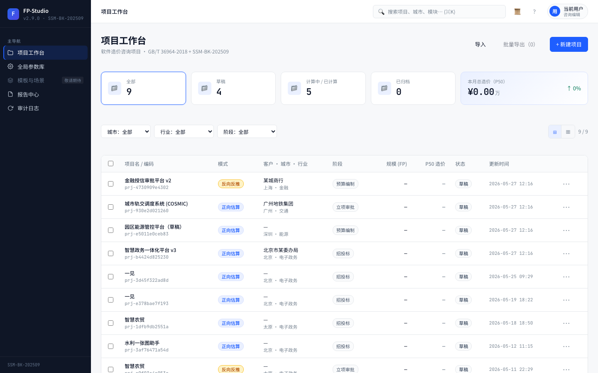

### 4.1 KPI 卡片

页面顶部是一行 KPI 汇总卡片，分别统计「全部 / 草稿 / 计算中 / 已归档」的项目数量。**点击某张卡片即可按该状态快速筛选**下方列表。再次点击「全部」恢复。

项目状态由系统自动派生：

- **草稿**：尚未录入功能点规模。
- **计算中**：已有功能点、但还没算出造价。
- **已计算**：功能点与造价均已就绪。

### 4.2 筛选栏

KPI 卡片下方是筛选栏，可按以下维度组合过滤：

- **城市**、**行业**、**阶段** 三个下拉筛选。
- 右侧提供 **表格 / 卡片** 两种视图切换按钮。

### 4.3 表格视图

默认以表格展示项目，列包括：项目名 / 编码、模式、客户·城市·行业、阶段、规模（FP）、P50 造价、状态、更新时间。

- **点击任意一行**即可打开该项目（进入 FP 编辑页）。
- 「模式」列用色块标识：蓝色为「正向估算」，琥珀色为「反向反推」。
- 每行末尾有一个 **⋯ 操作菜单**，点击展开后可：
  - **编辑设定**：重新进入项目向导修改设定。
  - **复制项目**：一键复制出一个新项目（连同功能点与参数覆盖一并复制）。
  - **删除**：删除项目（会同时清理该项目的上传文件、解析与导出文件）。

### 4.4 卡片视图

切换到卡片视图后，项目以网格卡片呈现，每张卡片显示项目名、模式、城市 / 行业 / 阶段标签、规模与 P50 造价。点击卡片同样进入该项目。

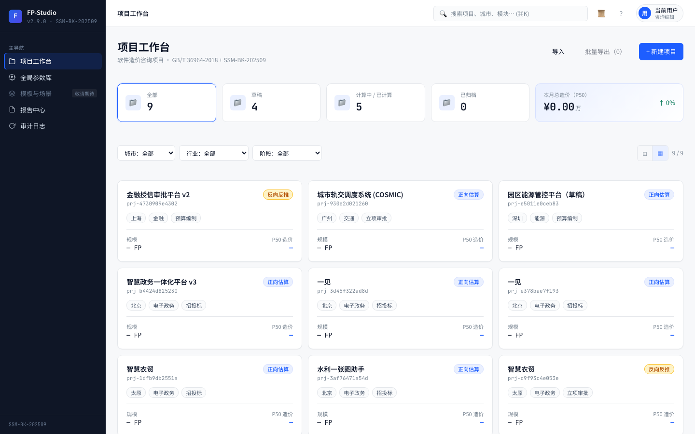

每行末尾的 **⋯ 操作菜单**展开后可对该项目执行编辑设定、复制、查看审计、删除等操作：

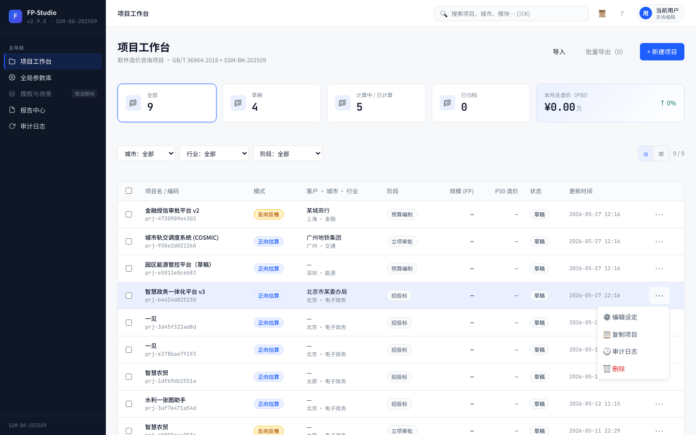

### 4.5 新建项目

点击页面右上角的 **「+ 新建项目」** 按钮，进入创建项目向导（详见第 5 章）。列表为空时，空状态区域也会提供「新建第一个项目」按钮。

### 4.6 批量导入 / 批量导出（v2.7 实装）

表格视图每行最左侧的复选框可勾选项目；选中后右上角「批量导出（N）」按钮会显示选中数量，点击即把所选项目（含功能点、参数 override、审计摘要）打包为 JSON bundle 下载。

「导入」按钮选择此前导出的 bundle 即可恢复或迁移项目；导入带规模上限校验，旧 bundle 会自动归一化字段（如 `modify_type` / `assessment_kind` / 草稿来源标识）兼容老格式。

---

## 5. 创建项目

新建项目采用 **7 步向导**，顶部步骤条会实时显示当前进度（第 N / 7 步）。每一步填写完成后点 **「下一步」**，可随时点 **「上一步」** 返回修改。

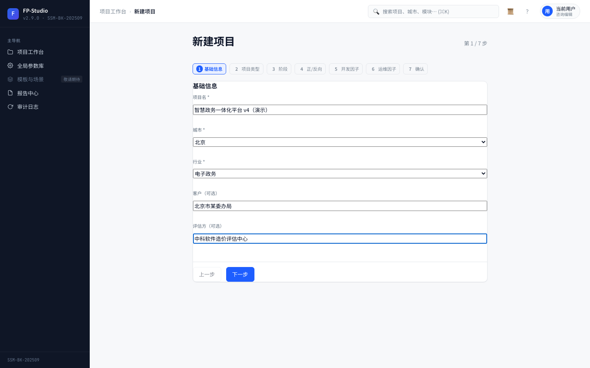

### 第 1 步 · 基础信息

- **项目名 \***（必填）：项目名称，最长 120 字。未填写时无法进入下一步。
- **城市 \***：从 37 个城市下拉中选择，决定后续套用的城市费率。
- **行业 \***：从「全行业 / 电子政务 / 金融 / 电信 / 制造 / 能源 / 交通」中选择，决定生产率基准。
- **客户（可选）**：委托方名称，会写入 Excel 报告封面。
- **评估方（可选）**：编制 / 评估单位名称，会写入 Excel 报告封面。

### 第 2 步 · 项目类型 / 评估口径 / 测量方法

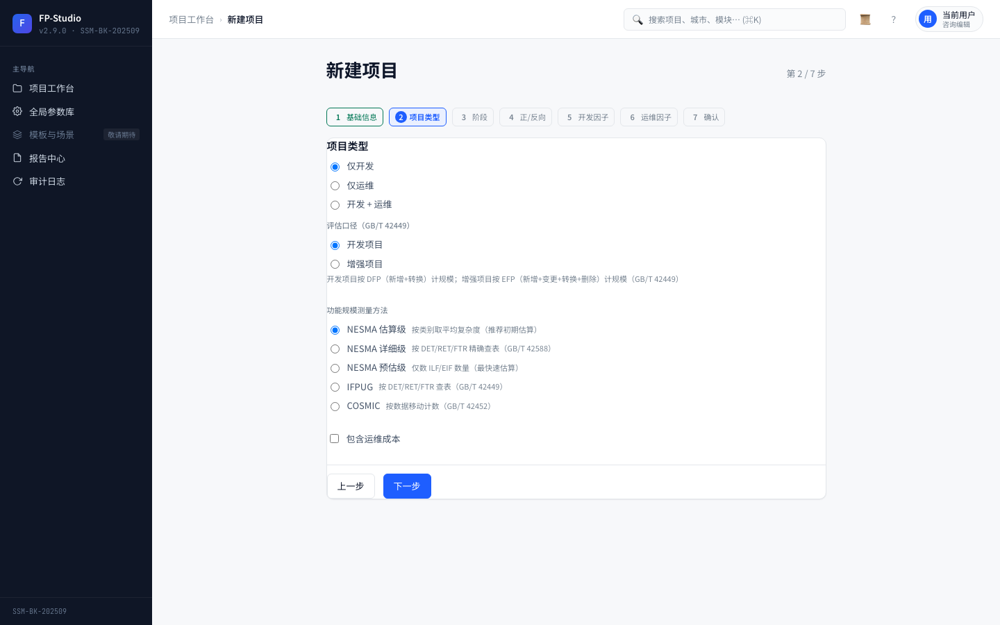


本步集中设定影响规模与工作量计算口径的三组核心选项：

**项目类型**——在「仅开发 / 仅运维 / 开发 + 运维」中三选一：

- 选「**仅开发**」时，可见「包含运维成本」复选框（默认不勾选）。
- 选「**开发 + 运维**」时，系统自动包含运维，并显示一个 **α 滑块**用于设定开发 / 运维成本的分配比例。
- 选「**仅运维**」时，系统自动按运维处理。

**评估口径（GB/T 42449，v2.8 起）**——在「**开发项目** / **增强项目**」中二选一：

- **开发项目**：按 DFP（新增 + 转换）计规模。
- **增强项目**：按 EFP（新增 + 变更 + 转换 + 删除）计规模。

口径仅影响规模汇总的取舍，不改变下游成本流水线。

**功能规模测量方法（v2.9 起）**——在 IFPUG / NESMA 三级 / COSMIC 五种之中单选（默认 **NESMA 估算级**）。每种方法在右侧悬停帮助里给出标准号与适用场景；FP 编辑表会按所选方法切换录入字段（详见第 6 章 6.5）。

> **跨录入模型切换警告**：IFPUG / NESMA 各级共用 5 类 + DET/RET/FTR 录入模型，相互切换 FP 数据沿用、仅按新方法重算规模；切到 / 切出 **COSMIC** 时（录入模型不同），系统会弹强警告——已有 FP 数据会保留但不参与新方法计算，需重新录入对应格式的功能点。

### 第 3 步 · 项目阶段

选择项目所处阶段（立项审批 / 预算编制 / 招投标 / 变更评估 / 结算审计）。页面会实时预览所选阶段对应的 **CF 阶段调整因子**值，让你在选择时即看到它对成本的影响。

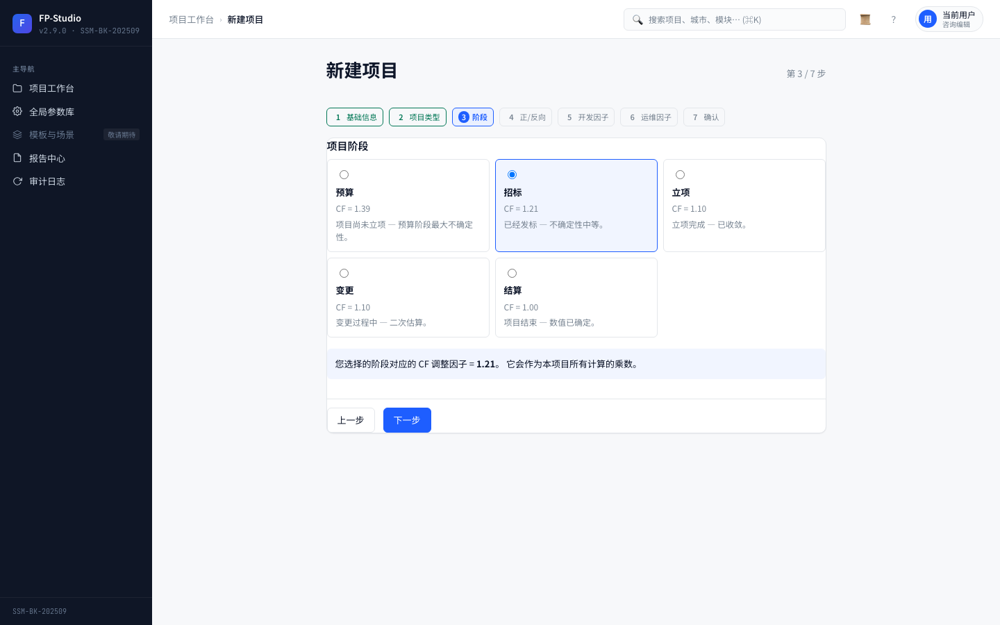

### 第 4 步 · 计算模式

二选一：

- **正向** — 已有功能点 → 估算成本。
- **反向** — 已有目标成本 → 推算功能点。

选择「反向」时，下方会出现 **「目标总成本（万元）\*」** 输入框，必须填写一个大于 0 的数值才能继续。

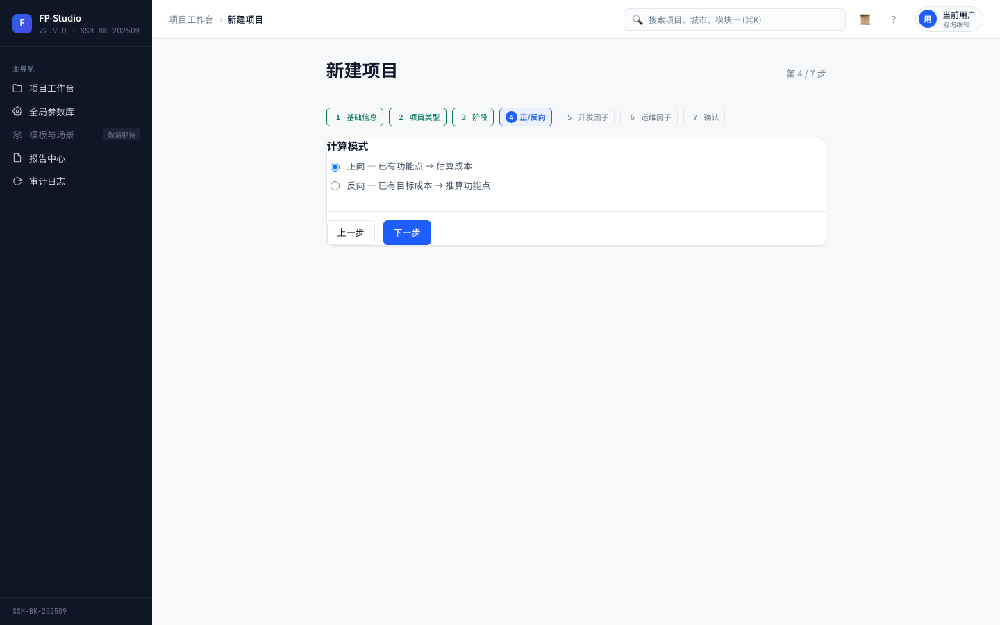

### 第 5 步 · 开发调整因子

针对开发工作量的 5 个调整因子（应用类型、完整性等级、非功能性要求、运行平台、团队背景）逐项选择级别：

- 不选 / 不填的因子按 **×1.00** 计算，不影响成本。
- 所有因子按所选级别的系数 **链式相乘**，页面底部实时显示「实时 dev_factor 链」乘积。
- 点击「📖 开发因子说明」可展开查看每个因子的含义；选项旁的「ⓘ」悬停可看每个级别的详细说明。

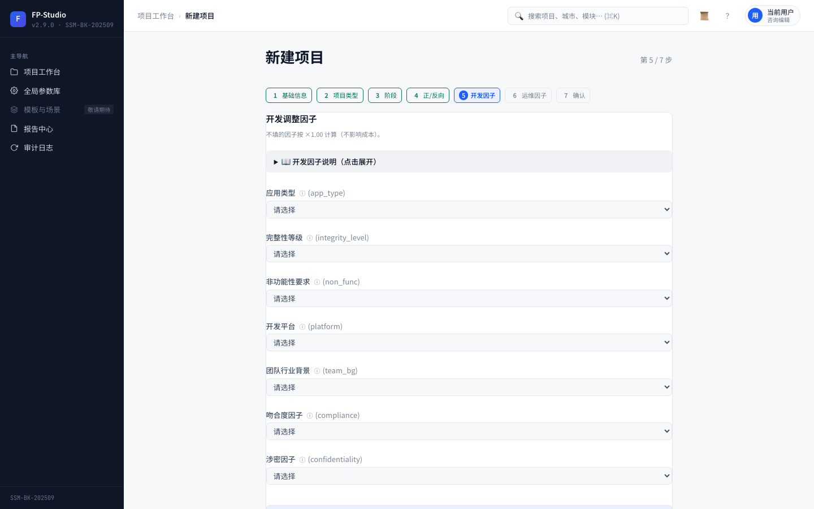

### 第 6 步 · 运维调整因子

- 若项目**未启用运维**，本步显示「本项目未启用运维，跳过运维因子」，直接进入下一步。
- 若项目**启用运维**，对运维相关的 11 个调整因子（更新频率、支持方式、安全等级、业务重要性、响应时间、团队经验、自动化程度、部署方式、用户规模、关联系统数等）逐项选择级别，规则与开发因子相同，底部显示「实时 ops_factor 链」乘积。

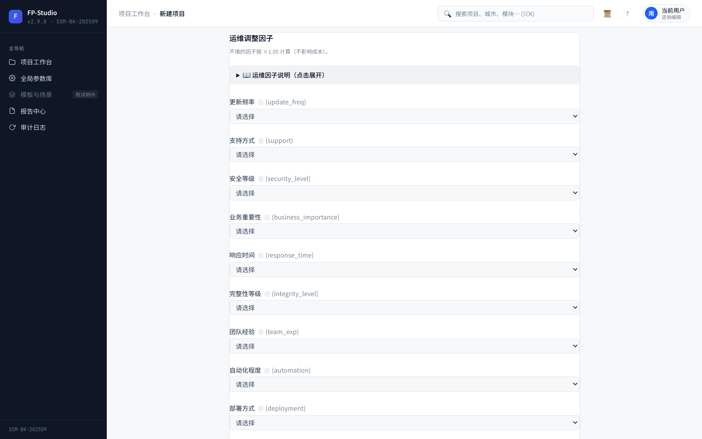

### 第 7 步 · 确认

以清单形式汇总前面所有设定（项目名、城市 / 行业、客户 / 评估方、类型、评估口径、测量方法、阶段及 CF、模式、已配置的开发 / 运维因子）。核对无误后点 **「创建项目」**。创建成功后自动跳转到该项目的 FP 编辑页。

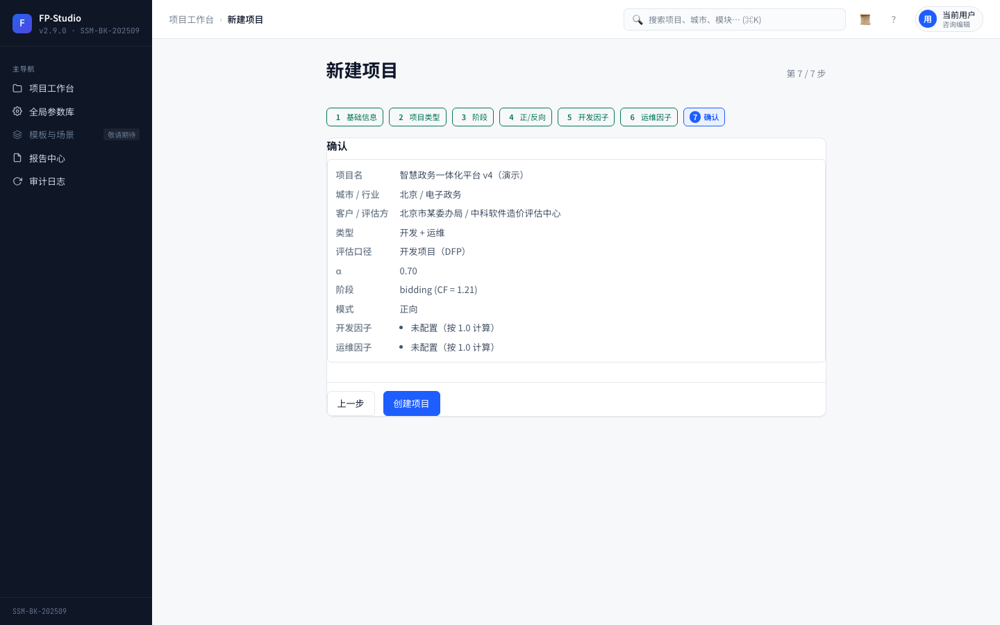

> **编辑已有项目**：从项目列表的 ⋯ 菜单点「编辑设定」，或在 FP 编辑页点「⚙️ 编辑设定」，会以同样的 7 步向导打开，并预填现有数据。此时第 7 步按钮为「保存项目」。

---

## 6. FP 编辑页

FP 编辑页用于录入和管理项目的功能点（Function Point），是正向计算的数据基础。页面顶部一行操作按钮，下方为已上传文件区与功能点表。

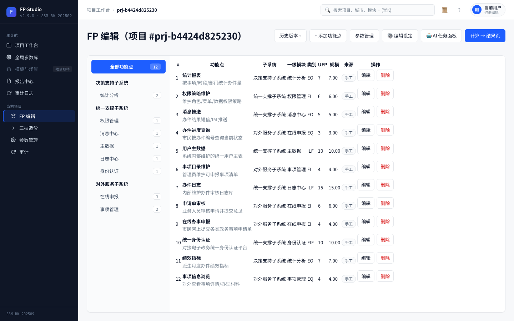

### 6.1 上传需求 / 设计文档

项目还没有任何功能点时，页面中央会显示空状态，点 **「上传文档让 AI 写第一稿」** 选择文件。

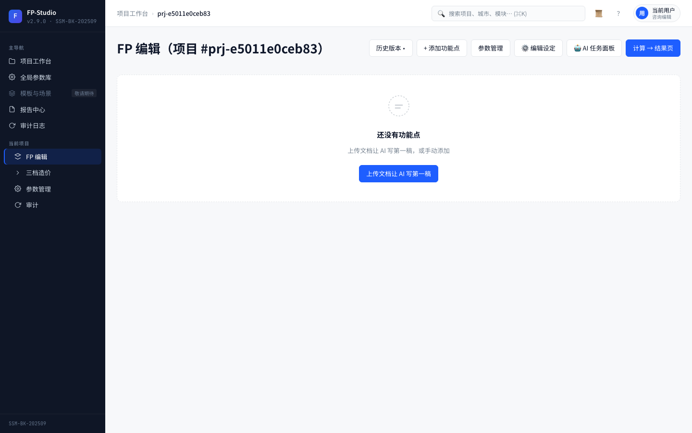

- **支持格式**：PDF、Word（.docx）、Excel（.xlsx）、Markdown（.md）、纯文本（.txt）。
- **大小上限**：单个文件最大 500MB。
- 上传成功后会弹窗提示，并引导你发起 AI 提取。

### 6.2 已上传文件区

上传过文档后，FP 编辑页会常驻显示一个「📁 已上传文件」区块，以表格列出每个文件的文件名、大小、类型、上传时间。每行有「删除」按钮可移除文件（删除后无法恢复）。

### 6.3 用 AI 提取功能点

点页面右上角的 **「🤖 AI 任务面板」** 打开任务面板：

1. 点 **「+ 新建提取任务」**，系统会在后台发起一个 AI 提取任务。
2. 面板实时刷新，显示任务状态（排队 / 运行中 / 完成 / 失败）、进度条与阶段日志。
3. AI 会读取已上传文档，**按项目当前所选的「功能规模测量方法」自动分支**：
   - **IFPUG / NESMA 系**：按 5 类（EI/EO/EQ/ILF/EIF）归类并给出复杂度。
   - **COSMIC**：按「功能过程 + 4 类数据移动（入口·出口·读·写）」提取并求和得 CFP。
4. 提取完成后，新生成的功能点会以「AI 草稿」来源标识、浅黄底色行高亮，提示你逐条审核。
5. 审核满意后可点面板里的 **「采纳 FP」** 按钮（v2.7 起），一键把所有草稿提升为正式版本（来源 `claude_draft` → `ai_extracted`），并自动留下一份快照便于回滚。

提取任务也可在 Claude Code 终端运行 `/cost-estimation:cost <项目编码>` 发起。上传完成后页面会自动轮询约 5 分钟，发现 AI 写入的新功能点会即时提示并刷新；你也可随时点提示条上的「立即刷新」。

> 运行中的任务可在面板里点「停止」终止。

### 6.4 功能点表

功能点以表格展示，列包括：序号、功能点（名称 + 描述）、子系统、一级模块、类别、UFP、规模、来源、操作。

「来源」列标识每条功能点的产生方式：手工、AI 提取、AI 草稿、预算倒推。

### 6.5 增 / 删 / 改功能点

- **新增**：点顶部 **「+ 添加功能点」**，在弹窗中填写。
- **编辑**：点某行的「编辑」按钮，在同样的弹窗中修改。
- **删除**：点某行的「删除」按钮，确认后移除。

功能点表单**按项目当前所选的测量方法切换**录入字段：

#### 通用字段（所有方法均显示）

- **功能点名称 \***（必填）。
- **描述**（选填）。
- **子系统 / 一级模块 / 二级模块**（选填，建议填写以支持模块树过滤与报告分项统计）。

#### IFPUG / NESMA 详细级（GB/T 42449 / 42588 详细级）

- **类别**：EI / EO / EQ / ILF / EIF。
- **DET / RET / FTR**：按 GB/T 42449 / 42588 附录定义填写，系统据此查表自动确定复杂度。
- **复杂度 + UFP（自动）**：由 DET / RET / FTR 联动算出，无需手填。

#### NESMA 估算级（默认方法）

- **类别**：EI / EO / EQ / ILF / EIF。
- **复杂度固定取「中」**：表单提示「估算级按平均复杂度计算」，DET / RET / FTR 不显示。
- **UFP（自动）**：按类别 × 中复杂度查 NESMA 表得到。

#### NESMA 预估级

- **类别**：仅显示 **ILF / EIF** 两项可选（其他三类在该方法下不参与计数）。
- **UFP（自动）**：按预估级公式 `UFP = a × #ILF + b × #EIF`（GB/T 42588 标准常数）。

#### COSMIC（GB/T 42452）

- **功能过程名称**：每条 FP 视为一个功能过程。
- **入口 / 出口 / 读 / 写** 4 项整数输入：分别填该功能过程的 4 类数据移动数。
- **CFP（自动汇总）**：实时显示「入口 + 出口 + 读 + 写」之和。
- 写入时 `category` 不参与计算（COSMIC 没有复杂度概念）。

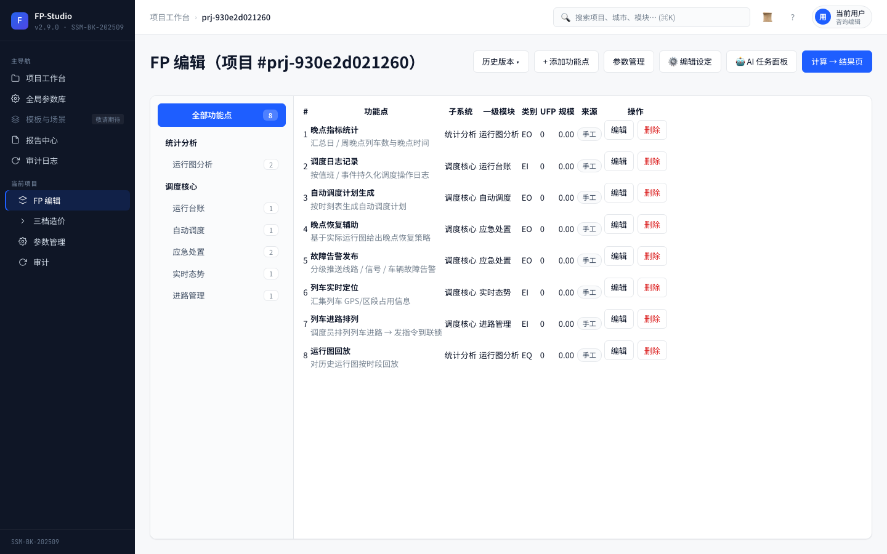

### 6.6 模块树过滤

页面左侧是模块树，按「子系统 → 一级模块」两级展开，每个节点显示该模块下的功能点数量。

- 点「全部功能点」显示所有功能点。
- 点某个一级模块，右侧表格只显示该模块下的功能点。

### 6.7 历史版本与恢复

点顶部 **「历史版本」** 按钮展开快照列表。每次批量写入功能点（如 AI 提取）系统会自动留一份快照，记录版本号、时间与功能点数量。

点某个版本的 **「恢复此版本」**，确认后会把当前功能点表替换为该版本快照。恢复前系统会自动再留一份当前快照，便于反悔。

### 6.8 进入计算

录入完成后，点顶部 **「计算 → 结果页」** 进入三档造价页。也可点「参数管理」先调整参数。

---

## 7. 参数管理

参数决定计算时套用的费率、生产率与调整因子。系统采用「全局参数库 + 项目级覆盖」两层结构：

- **全局参数库**（侧边栏「全局参数库」）：基准参数，影响所有项目。**v2.8 起支持草稿编辑**：在该页改动会进入草稿态，需点击顶部的「保存」「撤销」或「还原出厂」三按钮显式落库 / 回滚。
- **项目级参数管理**（项目子导航「参数管理」）：在全局基准之上做项目专属覆盖，**项目级覆盖优先于全局参数**；项目模式即时落库。

两者共用同一套界面，按 6 个 Tab 组织。

> 全局参数库顶部状态条会显示「● 有未保存的修改 / 参数已是最新保存状态」；「还原出厂」会丢弃所有全局参数改动，重置为基准数据集默认值（v2.9 起即 SSM-BK-202509 种子），操作前会二次确认。被覆盖过的参数项会有视觉标识。

### 7.1 费率

「城市费率（元/人月）」Tab。列出各城市的人月费率，**开发与运维各自独立**两栏费率，均可单项覆盖。

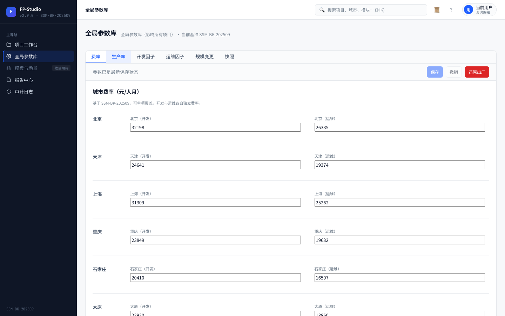

### 7.2 生产率

「生产率（FP/人月）」Tab。分「开发生产率」与「运维生产率」两组，按行业与 P10/P50/P90 三个分位列出，可单项覆盖。生产率代表每人月能完成的功能点数量，是工作量换算的核心参数。

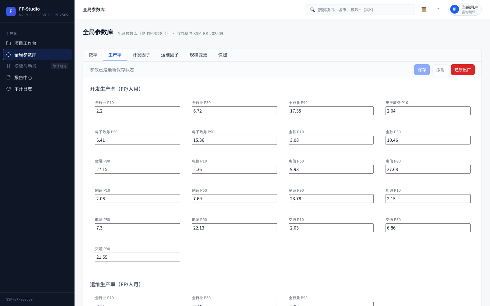

### 7.3 开发因子

「开发调整因子」Tab。以表格形式列出各开发调整因子的所有级别与系数。各因子按项目所选级别的系数链式相乘后作用于开发工作量。可在此调整某个级别的系数值。

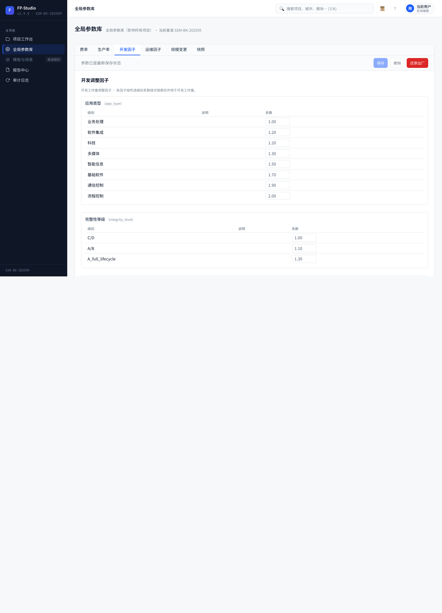

### 7.4 运维因子

「运维调整因子」Tab。结构与开发因子相同，作用于运维工作量。

### 7.5 规模变更

「规模变更因子」Tab。维护处理需求新增 / 删除 / 修改 / 转换场景以及变更率门槛的因子值，主要服务于「变更评估」阶段的项目。

> **CFP → FP 换算系数 `cfp_to_fp`**（v2.9 起）：COSMIC 项目走「FP 当量 = CFP ÷ `cfp_to_fp`」后再接 FP/人月生产率链。默认值 `1.2`（对应 1 NESMA-FP ≈ 1.2 CFP）。该系数随全局参数一起编辑，可在草稿态修改后点「保存」落库；非 COSMIC 项目不读取该系数。

### 7.6 快照与恢复

「快照」Tab 用于在重要节点固化当前参数：

- 在备注框填写说明（可选，如「调价实验前」），点 **「立即快照」** 创建。
- 快照列表显示 ID、备注、创建时间、作用域。
- 点某条快照的 **「恢复」**，确认后会把参数恢复到该快照时刻（当前未保存的修改会被覆盖）。
- 点 **「删除」** 移除不再需要的快照（不可撤销）。

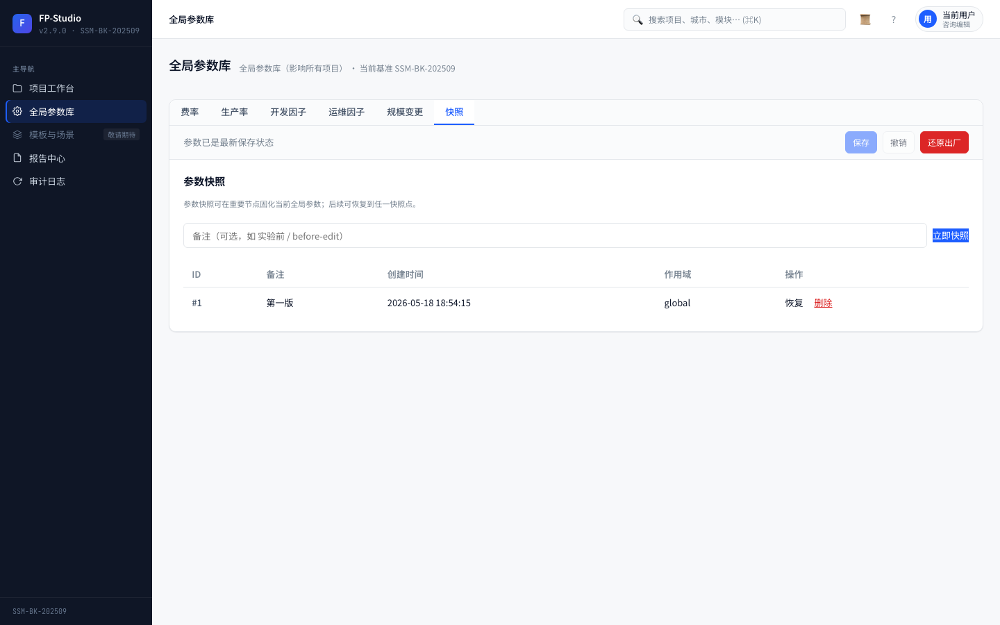

> 修改参数后，再回到该项目的三档造价页时，页面会出现「参数已变更，建议重新计算」的提示横幅，点击即可重算。

---

## 8. 三档造价 · 正向模式

正向项目进入「三档造价」页后会自动计算并展示结果。

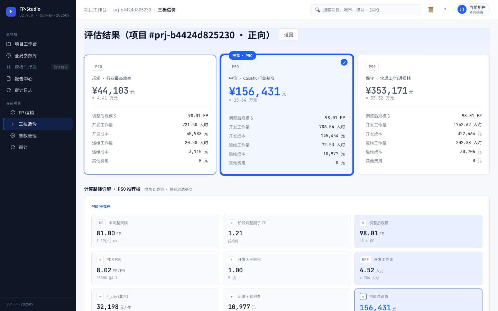

### 8.1 三档成本卡片 · 选档（v2.8 起）

页面顶部并排显示 P10 / P50 / P90 三档成本卡片：

- **P10 · 乐观 · 行业最高效率**
- **P50 · 中位 · SSM-BK 行业基准**（默认推荐档）
- **P90 · 保守 · 含返工 / 沟通损耗**

每张卡片除总造价外，还展开列出：调整后规模 S、开发工作量（人时）、开发成本、运维工作量、运维成本、其他费用。

**点击任意一张卡片即可切换当前档位**，所选档位会持久化到项目（`selected_band`），影响：

- 下方「计算路径详解」与「成本构成分布」展示的档位。
- 「下载 Excel 报告」导出的档位 —— 报告按所选档生成，反向项目的下载按钮也按当前档导出。

未手动选档的项目默认走 **P50** 推荐档。

### 8.2 计算路径详解

「计算路径详解」区块以分步网格展示**当前所选档位**的完整计算链路，从功能点规模、调整因子、生产率、费率到最终成本，每一步可追溯，便于复核与向甲方解释。COSMIC 项目会额外展示 CFP → FP 当量换算行（`CFP ÷ cfp_to_fp`）。

### 8.3 成本构成分布

「成本构成分布」区块用条形图展示 P50 档成本的开发 / 运维 / 其他费用占比。右侧的合规卡片给出该 P50 造价的合规性参考信息。

### 8.4 导出报告

页面底部有 **「下载 Excel 报告」** 按钮，导出该项目的完整评估报告（按当前所选档位导出，详见第 10 章）。

> 在参数管理中改过参数后回到本页，会出现重算提示横幅，点击即可用最新参数重新计算。

---

## 9. 三档造价 · 反向模式

反向项目用于「先有预算、倒推规模」的场景。进入「三档造价」页后，若项目已在向导中填过目标造价，系统会**自动反算**并展示结果。

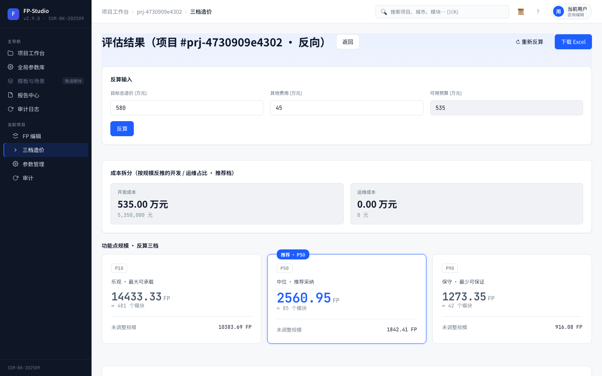

### 9.1 反算输入

页面顶部「反算输入」区有三个字段：

- **目标总造价（万元）**：项目预算总额。
- **其他费用（万元）**：需从总额中扣除的非开发 / 运维费用。
- **可用预算（万元）**：系统自动算出 =目标总造价 − 其他费用，只读。

修改输入后点 **「反算」** 重新计算。结果已存在时，右上角还有 **「↻ 重新反算」** 按钮。

### 9.2 单一规模模型

v2.6 采用**单一规模模型**：反算只产出**一个功能点规模**，开发与运维共用这一个规模。成本如何在开发与运维之间拆分，由系统依据生产率与费率自动推导，**无需再手动填写 α 分配系数**。

### 9.3 成本拆分

「成本拆分」区块展示在该单一规模下，系统按生产率 / 费率反推出的**开发成本**与**运维成本**两块占比（推荐档），同时给出万元与元两种单位。

### 9.4 功能点规模 · 反算三档

「功能点规模 · 反算三档」区块以三档卡片展示反算得到的功能点规模：

- **P10 · 乐观 · 最大可承载**
- **P50 · 中位 · 推荐采纳**
- **P90 · 保守 · 最少可保证**

每档同时显示「未调整规模」作为对照。

### 9.5 反算 UFP 模块细化分摊（三级模块树，v2.8 起）

若项目已有功能点清单，「反算 UFP 模块细化分摊」区块会把目标可承载的 UFP **按子系统 → 一级模块 → 二级模块三级树形结构逐层分摊**到项目现有功能点的真实模块，每个节点列出：**现有 UFP**、**分摊后 UFP**、**需细化增加**（绿色为增加、红色为减少）、占比。可逐层展开 / 折叠查看。

**按反算补全 FP**：表格顶部的 **「按反算补全 FP」** 按钮会发起 `reverse_fill` AI 任务，按反算分摊量级回写 FP 表——AI 会在原有功能点清单基础上按各模块的差额增补 / 调整 FP，让正向重算的结果对齐反算目标。任务过程在 AI 任务面板可见，完成后页面自动刷新功能点表。

### 9.6 模块分摊面板与写回 FP 表

页面下方的「FP 模块反算分摊」面板支持把反算规模分配到各模块并写回功能点表：

1. 面板列出项目真实功能点的各一级模块，每个模块可设「权重（现有规模合计）」与「锁定 FP」值。
2. 点 **「✨ 生成分摊」**，系统把推荐档目标规模按权重分摊到各模块，并展示「分摊结果」表与双向一致性校验（反算总规模、调整后规模、误差百分比，误差 ≤1% 为佳）。
3. 点 **「↩ 写回 FP 表」**，把每个模块分摊到的规模按该模块下各功能点的现有规模占比拆分，逐条写回功能点表。

> **写回前务必看清量级提示**：反算规模常远小于设计稿规模。写回会**整体覆盖**功能点的现有规模。若前后规模相差超过 5 倍或缩小到 1/5 以下，系统会弹出**强警告**，明确告知放大 / 缩小的倍数。原功能点规模被覆盖后无法自动撤销，但可在 FP 编辑页用「历史版本」恢复。
>
> 若项目暂无功能点，面板会提示先去 FP 编辑页上传文档或手动添加功能点。

### 9.7 导出报告

反算结果就绪后，页面右上角有 **「下载 Excel」** 按钮。反向项目报告中的总费用即等于你设定的目标造价。

---

## 10. 报告中心与 Excel 导出

### 10.1 报告中心

侧边栏「报告中心」集中列出所有项目，每行显示项目名、城市 / 行业、更新时间，并提供 **「下载 P50 报告」** 按钮，一键导出该项目的 Excel 评估报告。

各项目的「三档造价」页底部也有对应的下载按钮，效果一致。

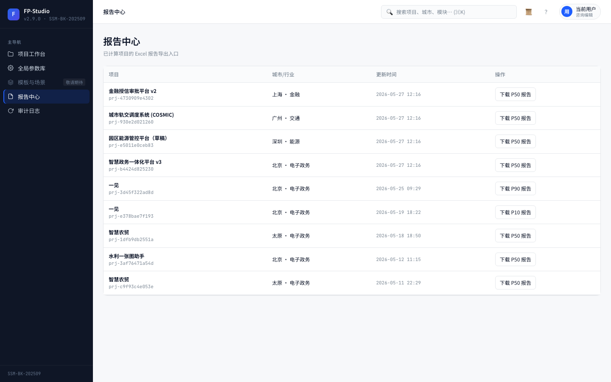

### 10.2 Excel 报告内容

导出的 Excel 是一份符合行业评估格式的多 Sheet 工作簿，包含：

1. **封面** — 项目名、客户、评估方、城市、行业、阶段、数据基准（SSM-BK-202509）等基本信息。
2. **评估结果汇总** — P10/P50/P90 三档造价与关键指标总览。
3. **模块功能点及费用分项统计表** — 按模块汇总功能点数量与对应费用分项。
4. **系统功能点明细表** — 逐条列出全部功能点（类别、复杂度 / 数据移动、UFP 等，按项目所选测量方法呈现）。
5. **评估报告书** — 六章文字叙述，**「三、评估方法」自动写入本项目的功能规模测量方法声明**（v2.9 起），含标准全称：
   - `<S> FP (IFPUG-GB/T 42449-2023)`
   - `<S> FP (NESMA-GB/T 42588-2023, <预估 / 估算 / 详细>)`
   - `<S> CFP (COSMIC-GB/T 42452-2023)` —— COSMIC 项目额外追加 **CFP → FP 当量换算备注**（含使用的 `cfp_to_fp` 系数值）。
6. **调整因子表** — 本次评估采用的全部开发 / 运维 / 阶段调整因子及取值。

报告按项目模式与当前所选档位（`selected_band`）导出，反向项目报告中的总费用等于设定的目标造价。

> **反向项目导出说明**：反向项目导出 Excel 需要项目中已录入功能点（可基于推荐档反算规模在 FP 编辑页录入，或通过模块分摊面板写回 / 按反算补全 FP）。若功能点为空，下载会失败并给出相应提示。

---

## 11. 审计日志

系统对所有产生数据变更的操作（创建 / 修改项目、写入功能点、调整参数等）自动记录审计事件，事件不可篡改、只追加。

### 11.1 项目审计

在项目子导航点「审计」，以时间线形式查看该项目的所有操作事件，按时间倒序排列，支持「加载更多」分页翻看。

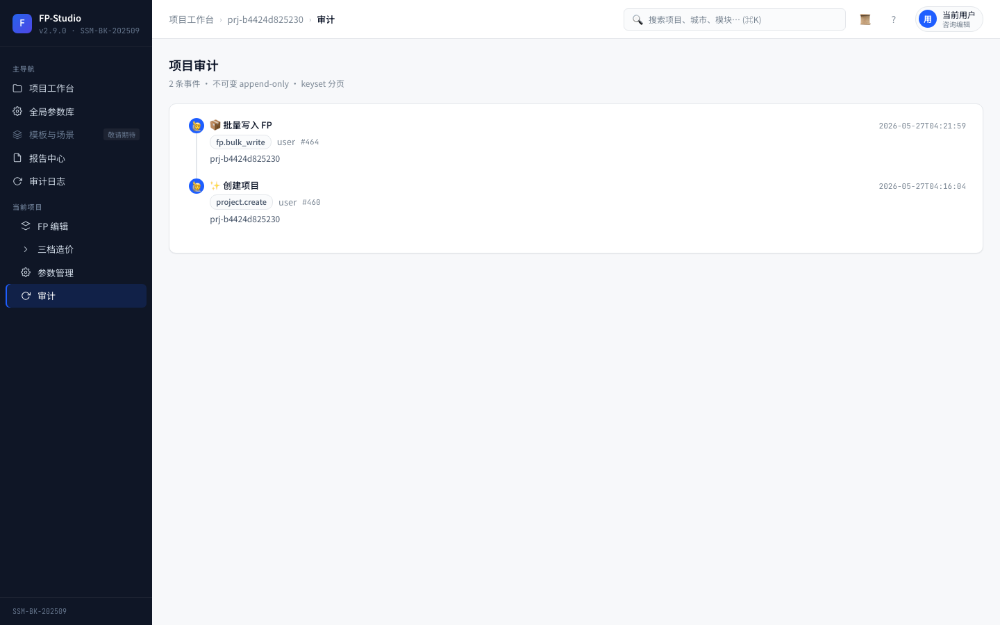

### 11.2 全局审计日志（v2.7 实装）

侧边栏「审计日志」为跨项目的全局聚合视图，按时间倒序展示所有项目的事件，每行带项目徽章可点击跳转到对应项目的审计页。支持分页加载，便于在多项目之间排查谁在什么时候动过什么数据。

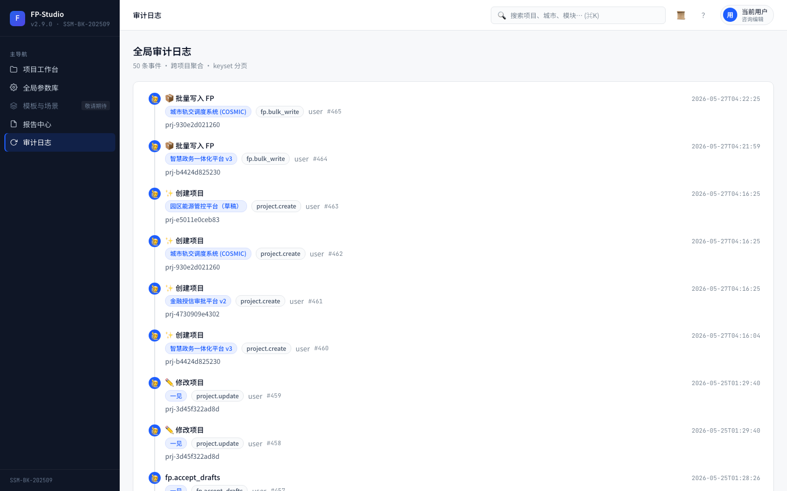

---

## 12. 常见问题与故障排查

### Q1：AI 提取任务一直卡住或长时间无进度

- 在「🤖 AI 任务面板」查看任务状态与阶段日志，确认任务是否仍在运行。
- AI 提取由 Claude Code 终端侧执行，请确认 Claude Code 终端正常、未中断。
- 任务显示「失败」时，查看面板里的错误信息；可点「停止」后重新「+ 新建提取任务」。
- 上传后页面自动轮询约 5 分钟即停止；若已运行提取但页面未刷新，手动刷新页面或点提示条的「立即刷新」。

### Q2：大文件上传失败

- 确认文件未超过 500MB 上限。
- 确认文件格式为 PDF / Word / Excel / Markdown / 纯文本之一。
- 上传失败会弹窗给出真实原因，按提示处理后重试。

### Q3：功能点提取后子系统 / 模块为空

- AI 提取要求每条功能点带「子系统 + 一级模块」。若文档结构不清晰可能提取不全。
- 可在功能点表中逐条「编辑」补全子系统与模块字段，以支持模块树过滤与报告分项统计。

### Q4：反算金额对不上 / 写回后正向计算结果有偏差

- 反向采用单一规模模型，开发 / 运维拆分由系统按生产率与费率推导，无需手填 α。
- 用「FP 模块反算分摊」面板的「生成分摊」并「写回 FP 表」后，正向计算可精确复现反算目标总额。
- 写回会整体覆盖功能点规模，注意写回前的量级提示与强警告；如需还原，去 FP 编辑页用「历史版本」恢复。

### Q5：报告导出失败

- **反向项目**：导出需要项目中已有功能点。请先在 FP 编辑页录入功能点，或用模块分摊面板写回后再导出。
- 确认项目已完成计算（有 P50 造价）。
- 确认后端服务仍在运行（参见 Q7）。

### Q6：改了参数但结果没变

- 参数修改后，需回到「三档造价」页点击重算提示横幅，或点「重新计算 / 重新反算」按钮才会用新参数。
- 项目级参数覆盖优先于全局参数；确认是否在正确的层级（项目 / 全局）做了修改。

### Q7：浏览器打不开界面 / 后端无响应

- 在 Claude Code 终端重新运行 `/cost-estimation:cost` 启动服务，并使用它输出的最新 URL。
- 若提示端口被占用，命令会自动尝试其他端口。
- 启动超时可查看后端日志文件 `/tmp/cost-estimation.log` 定位原因。
- 首次使用须先执行过 `/cost-estimation:setup` 完成安装。

### Q8：如何彻底关闭系统

- 运行 `/cost-estimation:cost-stop` 停止后端服务并清理临时文件。
- 项目数据保存在本地数据库中，停止服务不会丢失数据，下次启动依然可用。

### Q9：从 v2.6 / v2.8 升级，老项目的「测量方法」字段是什么？

- v2.9 升级会跑一次 alembic migration（`6fd4cb76f438`）加 `measurement_method` 与 COSMIC 四列。
- 老项目默认 `measurement_method = nesma_estimated`，行为与 v2.8 NESMA 估算一致，规模结果不会发生变化。
- 要切到 IFPUG 详细 / NESMA 详细 / COSMIC，进入「编辑设定」改方法即可；切到 COSMIC 时会有强警告，已有 FP 数据保留但不参与 COSMIC 计算，需按 4 类数据移动重新录入。

### Q10：COSMIC 项目的造价与 NESMA 项目能直接对比吗？

- 系统对 COSMIC 项目走 `FP 当量 = CFP ÷ cfp_to_fp`（默认系数 1.2）后接同一 FP/人月生产率与费率链，所以单价、工作量、成本结果与 NESMA / IFPUG 在同一量纲下可比。
- 但 CFP 与 FP 的颗粒度不同，**直接对比规模数字本身意义不大**；建议把比较点放在折算后的工作量或总成本上。
- 报告里 COSMIC 项目会附换算备注（含当前 `cfp_to_fp` 值），方便审计或评审方核对换算口径。

### Q11：基准数据是 CSBMK®-202510 还是 SSM-BK-202509？

- v2.9 起切换到 **SSM-BK-202509**（生效 2025-10-01，废止 SSM-BK-202409），覆盖全行业及 8 个分行业 P10–P90 生产率、维护型 / AI+开发生产率、缺陷密度、CF 表与功能点单价等。
- 旧 `csbmk_202510.json` 仍保留在源码中作为历史 golden 测试基线，但运行时种子已切到 SSM-BK-202509。
- 在「全局参数库」点击「还原出厂」会回滚到 SSM-BK-202509 种子值（会丢弃所有全局参数改动，操作前会二次确认）。

---

*本手册对应软件造价制作系统 v2.9.0，数据基准 SSM-BK-202509。界面文字以实际版本为准。*
