# 软件造价制作系统 · 用户操作手册

> 版本：v2.0.0 · 适用 plugin v2.0.0 · 数据基准 **CSBMK®-202510**
> 编写日期：2026-05-11 · 适用方法学：NESMA 估算法（兼容 IFPUG 详细计数）
> 合规依据：GB/T 36964-2018 / T/CCUA 005-2024 / GB/T 28827.7-2022 / GB/T 42452-2023
> v2.0 新增：11 项 gap-closure（详见[第 12 章](#第-12-章-v20-新功能与迁移)）

---

## 目录

- [第 1 章 系统介绍](#第-1-章-系统介绍)
- [第 2 章 安装与启动](#第-2-章-安装与启动)
- [第 3 章 主屏导览](#第-3-章-主屏导览5-屏)
- [第 4 章 正向模式完整流程](#第-4-章-正向模式完整流程)
- [第 5 章 反向模式完整流程](#第-5-章-反向模式完整流程)
- [第 6 章 端到端案例：政务服务平台](#第-6-章-端到端案例政务服务平台附录-d-算例)
- [第 7 章 参数与因子详解](#第-7-章-参数与因子详解)
- [第 8 章 Excel 报告说明](#第-8-章-excel-报告说明)
- [第 9 章 最佳实践](#第-9-章-最佳实践)
- [第 10 章 常见问题（FAQ）](#第-10-章-常见问题faq)
- [第 11 章 国标依据](#第-11-章-国标依据)
- [第 12 章 v2.0 新功能与迁移](#第-12-章-v20-新功能与迁移)
- [附录 A 公式速查](#附录-a-公式速查)
- [附录 B 词汇表](#附录-b-词汇表)
- [附录 C 联系与支持](#附录-c-联系与支持)

---

## 第 1 章 系统介绍

### 1.1 系统定位（双向估算）

软件造价制作系统是一款基于 **Claude Code Plugin** 的本地化软件造价评估工具，提供两种互逆的估算路径：

- **正向估算**（Forward）：上传需求文档（功能清单 / 用户手册 / 可研报告 / 初步设计）→ 系统自动识别功能点（Function Points, FP）→ 套用调整因子 → 输出三档（P10 / P50 / P90）造价金额。
- **反向反推**（Reverse）：输入目标预算金额 → 系统按 PDR（Project Delivery Rate, 项目交付率）三档生产率反推可承载的功能点规模 → AI 辅助按模块分摊 FP → 验证反算误差 ≤1%。

> 💡 两种模式共用同一套 CSBMK®-202510 行业基准与 GB/T 36964 算法，结果可在同一项目中比对。

### 1.2 适用场景

| 阶段 | 调整因子 CF | 典型用途 |
|---|---|---|
| **预算编制（budget）** | 1.39 | 立项前粗算、年度预算上报 |
| **招投标（bidding）** | 1.21 | 招标方拟定预算、投标方报价对标 |
| **立项审批（planning）** | 1.10 | 可行性研究、批复用造价 |
| **变更评估（change）** | 1.10 | 合同变更、需求新增金额测算 |
| **结算审计（settled）** | 1.00 | 项目结算、第三方造价审计 |

### 1.3 国标合规依据

本系统严格遵循以下国家标准与行业基准（详见[第 11 章](#第-11-章-国标依据)）：

- **GB/T 36964-2018**《软件工程 软件开发成本度量规范》
- **T/CCUA 005-2024**《软件研发成本度量规范实施指南》（含附录 A FP 计数表 / 附录 C 评估报告模板 / 附录 D 完整算例）
- **GB/T 28827.7-2022**《信息技术服务 运行维护 第 7 部分：成本度量规范》
- **GB/T 42452-2023**《软件工程 软件开发成本度量规范 应用指南》
- **CSBMK®-202510**（China Software Benchmarking Data, 2025-10 版基准数据）

### 1.4 核心特性

- **双向互通**：Forward / Reverse 双模式，支持同一项目切换比对
- **三档区间**：直接基于 PDR 的 P10 / P50 / P90 行业分布，避免主观 ±20% 假设
- **全量参数可编辑**：35+ 城市费率、6 大行业生产率、17 张调整因子表均可单项覆盖
- **AI 辅助**：Claude 自动从文档生成 FP 初稿，用户在 Web 表格中微调
- **本地运行**：所有数据存储在 `~/.claude/projects/cost-estimation/`，零网络依赖（除安装阶段）
- **零配置安装**：`/cost-estimation:setup` 一键完成 venv + 依赖 + 数据库 + seed
- **标准 Excel 输出**：7 Sheet 完整报告（封面 / 摘要 / 报告书 / 因子 / FP 表 / 详细计算 / 参数附录）

---

## 第 2 章 安装与启动

### 2.1 系统要求

| 项 | 最低 | 推荐 |
|---|---|---|
| 操作系统 | macOS 11+ / Ubuntu 20.04+ / Windows 10 + WSL2 | macOS 14+ / Ubuntu 22.04+ |
| Python | 3.11.0 | 3.12.x |
| libmagic | 必须 | — |
| 内存 | 4 GB | 8 GB+ |
| 磁盘 | 1 GB（含依赖） | 2 GB+ |
| Node.js | 仅当 `web/dist/` 缺失时需要 | 20.x + pnpm 9 |
| Claude Code | 1.0+ | 最新版 |

> 📌 macOS / Linux 用户原生支持；Windows 用户必须通过 **WSL2** 运行（PowerShell / cmd 不支持 libmagic）。

#### 安装 libmagic

```bash
# macOS
brew install libmagic

# Ubuntu / Debian
sudo apt-get install -y libmagic1

# RHEL / CentOS
sudo yum install -y file-libs
```

### 2.2 一键安装（4 步）

> 📷 [图 2-1] Claude Code 中执行 `/plugin marketplace add` 后的输出（绿色 ✓ 标记 + plugin 详情卡）

#### 第 1 步：添加 marketplace

```bash
/plugin marketplace add github.com/vinnyren/cost-estimation
```

#### 第 2 步：安装 plugin

```bash
/plugin install cost-estimation
```

> 📌 plugin 自动下载到 `~/.claude/plugins/cache/cost-estimation/`（部分 Claude Code 版本为 `~/.claude/plugins/data/cost-estimation/`）。

#### 第 3 步：首次初始化

```bash
/cost-estimation:setup
```

该命令将依次执行：

1. **Preflight 检测**：Python 版本（≥3.11）、libmagic、pip 镜像可达性
2. **创建 Python 虚拟环境**：`server/.venv`
3. **创建数据目录**：`~/.claude/projects/cost-estimation/{db,uploads,exports}`
4. **安装 Python 依赖**（默认走清华镜像 `pypi.tuna.tsinghua.edu.cn`）
5. **初始化 SQLite + 装载 CSBMK®-202510 默认参数**
6. **检查前端 dist**（缺失时尝试 pnpm/npm 本地构建）

#### 预期输出

```
PLUGIN_DIR=/Users/<you>/.claude/plugins/cache/cost-estimation
DATA_DIR=/Users/<you>/.claude/projects/cost-estimation
✓ Python 3.12.4
✓ libmagic: /opt/homebrew/lib/libmagic.dylib
✓ pip 镜像可达
✓ Preflight 全部通过。
（pip install 输出...）
✓ 已装载 CSBMK seed（版本 CSBMK®-202510）。
✓ 数据库初始化完成: ~/.claude/projects/cost-estimation/db/cost.sqlite
✓ 安装完成。运行 /cost 即可启动 Web 界面
```

#### 第 4 步：启动 Web 服务

```bash
/cost
```

> 📷 [图 2-2] 浏览器自动打开 `http://127.0.0.1:8788/?t=<token>` 后的项目列表首屏

启动成功后浏览器自动打开 `http://127.0.0.1:8788/?t=<token>`（端口与 token 自动注入）。

### 2.3 首次启动验证

打开浏览器后，应看到 **"项目列表"** 屏。若为首次启动，列表为空，中央显示 hero CTA **"新建第一个项目"**。

执行健康检查：

```bash
PORT=$(cat ~/.claude/projects/cost-estimation/.port)
curl -fsS "http://127.0.0.1:${PORT}/health"
# 期望输出：{"ok":true,"data":{"status":"healthy"}}
```

### 2.4 数据目录与备份

| 路径 | 用途 |
|---|---|
| `~/.claude/projects/cost-estimation/db/cost.sqlite` | **核心数据库**（项目 / FP / 参数 / 结果） |
| `~/.claude/projects/cost-estimation/uploads/<project_id>/` | 用户上传的需求文档原文件 |
| `~/.claude/projects/cost-estimation/exports/` | 生成的 Excel 报告 |
| `~/.claude/projects/cost-estimation/.token` | **一次性 token**（启动时生成、停止时清除） |
| `~/.claude/projects/cost-estimation/.port` | 当前监听端口 |
| `~/.claude/projects/cost-estimation/.pid` | 后端进程 PID |

#### 备份

> 💡 直接复制 `cost.sqlite` 即可备份所有项目、FP、参数、结果。建议每周备份一次。

```bash
DATA_DIR="$HOME/.claude/projects/cost-estimation"
cp "$DATA_DIR/db/cost.sqlite" "$DATA_DIR/db/cost.sqlite.bak.$(date +%Y%m%d)"
```

#### 跨机器迁移

```bash
# 源机器
tar czf cost-data.tgz -C ~/.claude/projects cost-estimation

# 目标机器
mkdir -p ~/.claude/projects
tar xzf cost-data.tgz -C ~/.claude/projects
```

迁移后在目标机器重新执行 `/cost-estimation:setup` 重建 venv（数据保留）。

### 2.5 停止与卸载

#### 停止服务

```bash
/cost-estimation:cost-stop
```

清理：进程 kill + 删除 `.pid` / `.token` / `.port`。

#### 卸载

```bash
/plugin uninstall cost-estimation
rm -rf ~/.claude/projects/cost-estimation       # ⚠ 会删除全部数据
rm -rf ~/.claude/plugins/cache/cost-estimation
```

> ⚠️ `rm -rf` 不可逆，请先备份 `cost.sqlite`。

---

## 第 3 章 主屏导览（v2.0 共 6 屏）

系统共 6 个主屏，按典型使用顺序：

| # | 屏 | 路由 | 用途 |
|---|---|---|---|
| 1 | 项目列表 | `/` | 总览 + 搜索 / 筛选 / 排序 / 复制（GAP-F/I） |
| 2 | 项目向导 | `/projects/new` | 7 步新建（GAP-E/G/K） |
| 3 | FP 编辑 | `/projects/:id/functions` | 功能点录入 + AI 提取入口（GAP-A） |
| 4 | 参数管理 | `/projects/:id/parameters` | 6 tab：费率 / 生产率 / 因子 / 规模变更 / 快照（GAP-B/D/H） |
| 5 | 结果页 | `/projects/:id/result` | 三档造价 + 反向 allocator（GAP-C） |
| 6 | **审计日志** | `/projects/:id/audit` | 项目操作时间线（GAP-J，v2.0 新增） |

各屏深度教程见第 12 章。

### 3.1 项目列表（`/`）

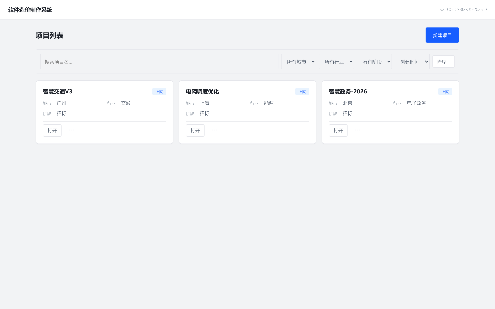

#### 字段表（项目卡片）

| 字段 | 来源 | 说明 |
|---|---|---|
| `name` | 用户输入 | 项目名称 |
| `mode` | forward / reverse | 模式徽章（蓝色=正向 / 红色=反向） |
| `city` | 37 城下拉 | 城市（影响人月费率） |
| `industry` | 7 行业 | 行业（影响 PDR 生产率） |
| `phase` | budget / bidding / planning / change / settled | 评估阶段（决定 CF） |
| `total_fp` | 计算后填充 | 当前调整后规模 (FP) |
| `total_cost` | 计算后填充 | 当前 P50 总造价（万元） |

#### 5 态说明

| 状态 | UI 表现 |
|---|---|
| **Loading** | skeleton 卡片 ×3 |
| **Empty** | 中央插画 + "新建第一个项目" hero CTA |
| **Error** | 顶部红色 banner（problem + cause + 重试按钮） |
| **Partial** | 部分加载完显示 + "..." 占位 |
| **Success** | 卡片网格（每卡 280px 宽，自动填充） |

#### 操作

- 点 **"新建项目"** → 跳转项目向导
- 点卡片 **"打开"** → 跳转 FP 编辑屏
- 点卡片 **"删除"** → 弹确认对话框（输入项目名二次确认）

### 3.2 项目向导（`/projects/new`）

v2.0 — **7 步进度条**，每步独立 fieldset（v1.1 是 5 步）：

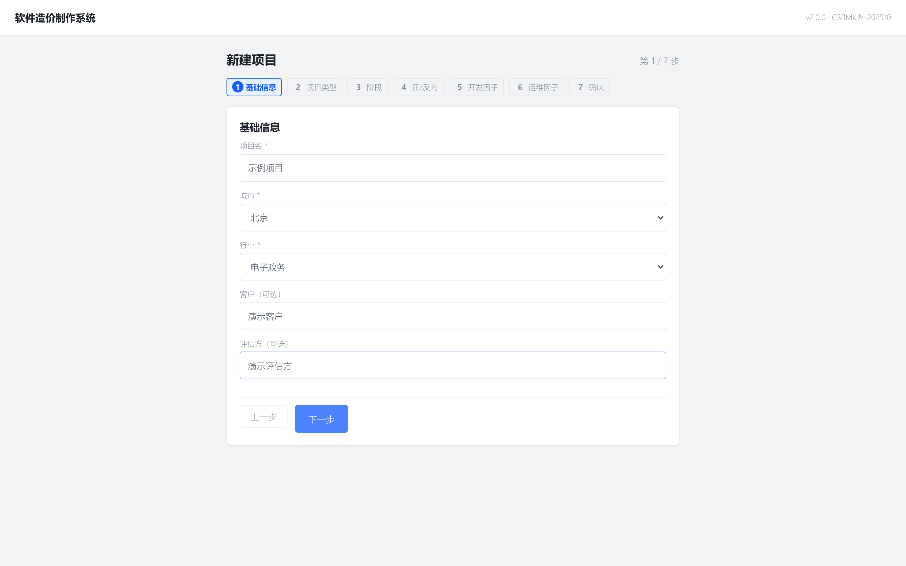

| 步骤 | 内容 |
|---|---|
| Step 1 | 基础信息：名称 + 城市 + 行业 + **客户 / 评估方**（可选） |
| Step 2 | 项目类型 + α 滑块（dev_and_ops 时） + include_ops 联动 |
| Step 3 | 阶段 + **CF 实时预览** |
| Step 4 | 正向 / 反向；反向时填目标总造价 |
| Step 5 | 开发因子 5 项 dropdown + 实时 dev_factor 链 |
| Step 6 | 运维因子 11 项（仅 include_ops 时显示） |
| Step 7 | 确认 + "创建项目" |

完整每步说明 + 截图见 [§12.3 Wizard 7 步指南](#123-wizard-7-步指南gap-e--gap-g--gap-k)。

37 个城市与 7 个行业的完整列表：

- **城市**：北京 / 上海 / 深圳 / 杭州 / 苏州 / 南京 / 广州 / 西安 / 成都 / 厦门 / 福州 / 宁波 / 武汉 / 合肥 / 长沙 / 重庆 / 沈阳 / 大连 / 青岛 / 济南 / 哈尔滨 / 昆明 / 太原 / 南昌 / 南宁 / 海口 / 拉萨 / 贵阳 / 天津 / 长春 / 郑州 / 兰州 / 西宁 / 乌鲁木齐 / 石家庄 / 呼和浩特 / 银川
- **行业**：全行业 / 电子政务 / 金融 / 电信 / 制造 / 能源 / 交通

> 💡 城市与行业决定 PDR 生产率与人月费率，影响最终金额；不在列表的城市/行业可在创建后到"参数管理"添加自定义键。

### 3.3 FP 编辑（`/projects/{id}/functions`）

空状态（提示用户用 `/cost`）：

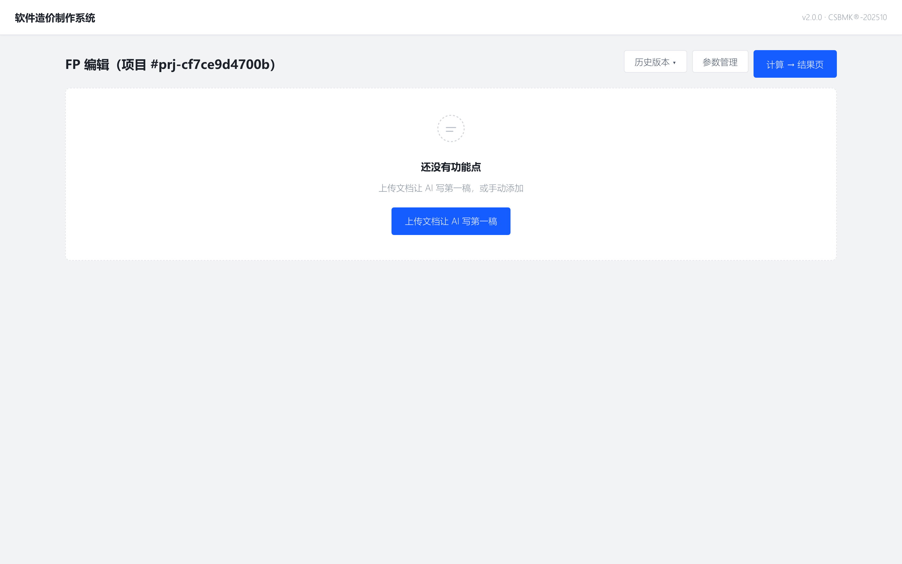

数据态（含 claude_draft 高亮）：

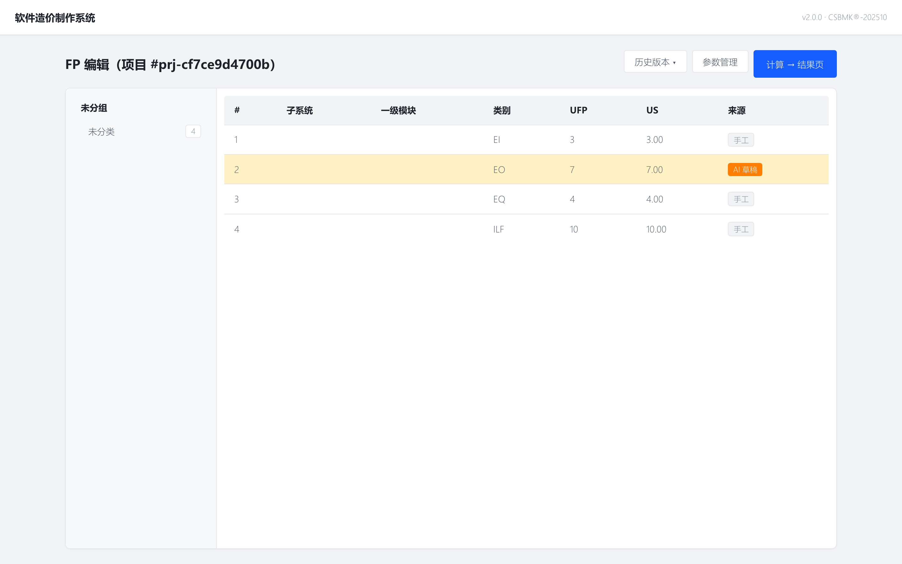

布局：左侧 240px 模块树 + 右侧主表格。

#### 模块树

按 `subsystem → l1_module → l2_module` 三级折叠，默认仅展开第一级。

#### 表格列

| 列 | 字段 | 说明 |
|---|---|---|
| # | 行号 | 自增 |
| 子系统 | `subsystem` | 文本，自由分组 |
| 一级模块 | `l1_module` | 文本，模块树第二级 |
| 类别 | `category` | EI / EO / EQ / ILF / EIF（NESMA 5 类） |
| UFP | `ufp` | 未调整功能点（数字） |
| US | `us` | 未调整规模（自动按 NESMA 公式计算） |
| 来源 | `source` | 5 种取值，见下表 |

#### `source` 来源标签

| 值 | 含义 | 视觉 |
|---|---|---|
| `manual` | 用户手动添加 | 灰色 |
| `ai_extracted` | AI 从文档提取 | 蓝色（accent） |
| `claude_draft` | Claude 直接初稿（兼容老字段） | 蓝色 |
| `allocator` | 反向模式预算倒推 | 红色加粗（行底色琥珀） |
| `imported` | Excel 模板导入 | 绿色 |

#### 5 态说明

| 状态 | UI 表现 |
|---|---|
| **Loading** | skeleton 行 ×8 |
| **Empty** | hero CTA "上传文档让 AI 写第一稿" |
| **Error** | banner + "查看错误详情" 可展开 |
| **Partial** | AI 提取部分写入显示进度（如 12/87）+ 取消按钮 |
| **Stale** | 顶部黄条 "参数已变，重新计算" + 按钮 |

#### 工具栏

- **上传文档**（接受 `.pdf .docx .xlsx .md .txt`，单文件 ≤50 MB）
- **AI 辅助提取**（空表时为屏中央 hero CTA；有数据时降级为 primary 工具栏按钮）
- **参数管理**（跳参数管理屏）
- **计算 → 结果页**

### 3.4 参数管理（`/projects/{id}/parameters`）

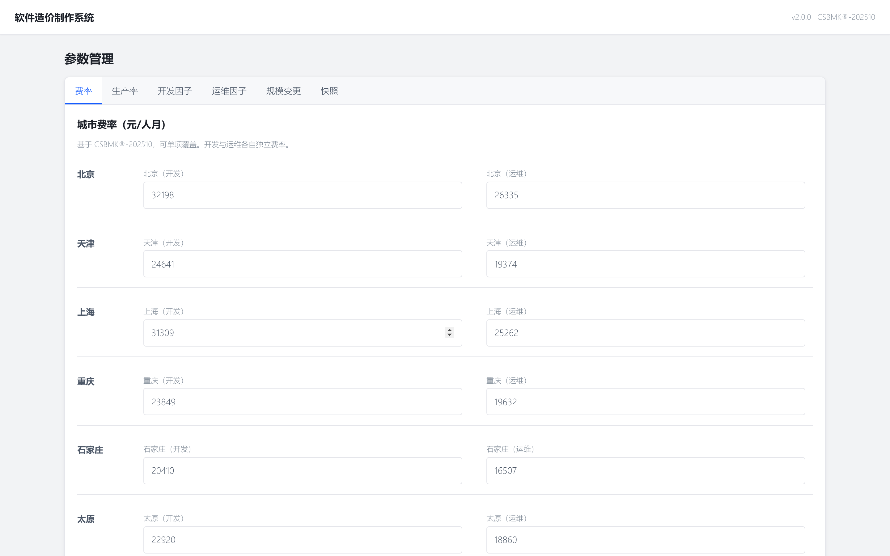

6 Tab 全部 v2.0 实装（v1.1 时 4 个 stub）：

#### 6 Tab 结构

| Tab | 字段 | 默认值来源 |
|---|---|---|
| **费率** (`rate`) | 37 城市的 dev 元/人月 | CSBMK®-202510 §4.7 |
| **生产率** (`productivity`) | 7 行业 × 3 档（P10/P50/P90） | CSBMK®-202510 §4.1 |
| **开发因子** (`factors_dev`) | 5 项 | GB/T 36964 附录 B |
| **运维因子** (`factors_ops`) | 11 项 | GB/T 28827.7-2022 |
| **规模变更** (`scale_change`) | 阶段 CF + 重用率/修改率 | T/CCUA 005-2024 §6 |
| **快照** (`snapshots`) | 历史参数快照查看 | 系统自动 |

#### 覆盖项视觉规范（WCAG 2.1 AA）

- 浅琥珀底色 `oklch(96% 0.08 95)`
- 左侧 3px 实线 `oklch(70% 0.15 70)`
- 行尾 **"自定义"** 徽章

#### 操作

- 单字段直接编辑 → 自动写入 `params_override` 表（项目级，不影响全局）
- **"恢复默认"** 按钮 → 删除该字段的项目级覆盖
- **"重置全部"**（快照 Tab）→ 清空当前项目所有覆盖（需输入 `RESET_GLOBAL` 二次确认）

### 3.5 结果页（`/projects/{id}/result`）

正向结果页（三档卡片 + 下载报告）：

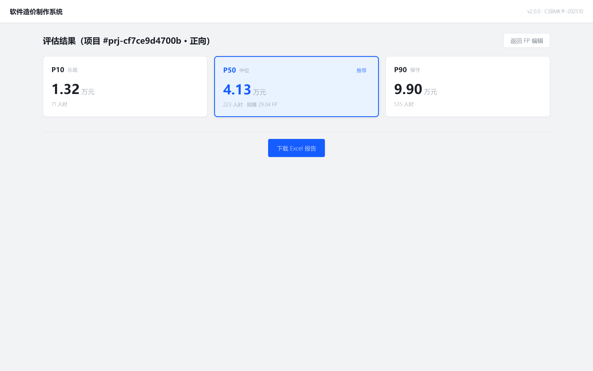

反向结果页（三档 FP + AI 模块分摊 panel）：

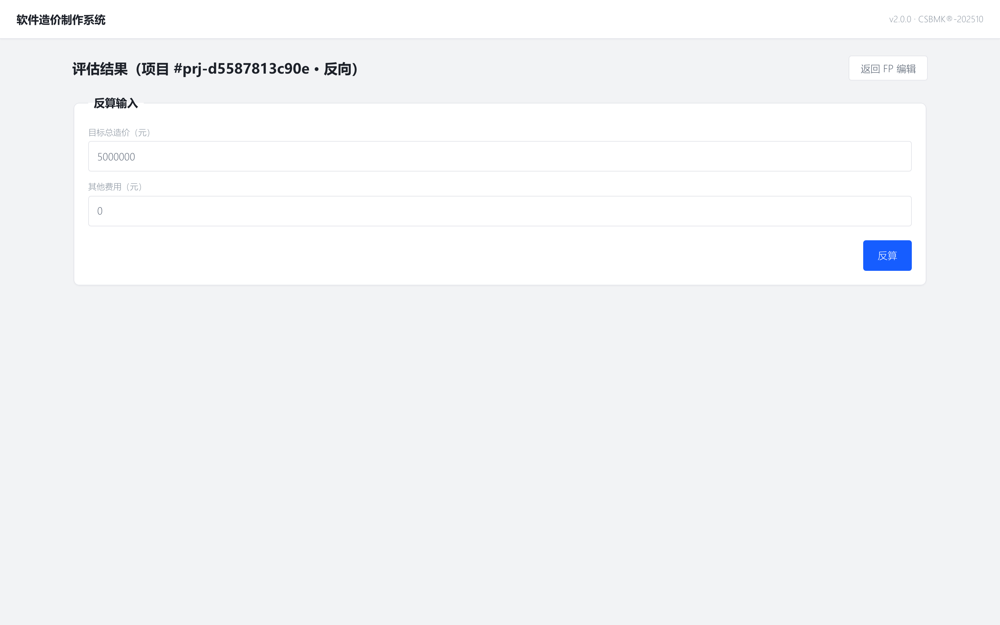

#### 正向模式

顶部三张结果卡片横排，**P50 居中加 "推荐" 徽章**：

| 卡 | 显示 |
|---|---|
| **P10**（左） | `cost_total_yuan.P10` 元 + `effort_dev_hours.P10` 人时 |
| **P50**（中，推荐） | `cost_total_yuan.P50` 元 + 人时 + 调整后 FP 规模 |
| **P90**（右） | `cost_total_yuan.P90` 元 + 人时 |

#### 反向模式

顶部反算输入 fieldset：

- **目标总造价（元）**（必填）
- **其他费用（元）**（默认 0）

点 **"反算"** 后显示三档 FP 卡片。

#### 5 态说明

| 状态 | UI 表现 |
|---|---|
| **Loading** | spinner + "计算中…" |
| **Empty** | "请先完成 FP 编辑" + 跳回链接 |
| **Error** | 红色 banner + "查看错误详情" |
| **Partial** | 部分计算完显示已知值 + "..." 占位 |
| **Stale** | 顶部黄条 + "重新计算"按钮（不阻止下载，但提示） |

#### 底部操作

- **下载 Excel 报告**（异步生成，文件名 `<项目名>.xlsx`）

---

## 第 4 章 正向模式完整流程

### 4.1 流程总览

```
新建项目(forward)
  → 元信息(城市/行业/阶段)
  → 上传文档
  → "AI 辅助提取" → Claude 读 → 写回 FP 初稿
  → FP 表格微调
  → 调整因子设置（可选）
  → 计算 → 三档结果
  → 下载 Excel
```

### 4.2 准备需求文档

支持的文档格式与提取效果：

| 类型 | 后缀 | 推荐场景 | 提取质量 |
|---|---|---|---|
| **PDF** | `.pdf` | 已有 OCR 文字层的可研报告、用户手册 | ★★★★ |
| **Word** | `.docx` | 标题层级清晰的需求规格书 | ★★★★★ |
| **Excel** | `.xlsx` | 功能点清单、模块矩阵表 | ★★★★★ |
| **Markdown** | `.md` | 技术文档、PRD | ★★★★ |
| **纯文本** | `.txt` | 简单清单 | ★★★ |

> 💡 PDF 文档若无文字层（扫描件），先用 OCR 工具（如 PaddleOCR、ABBYY）转换。本系统不内置 OCR。

#### 文档内容规范（建议）

最佳的 AI 提取效果建议文档包含：

- **明确的模块层级**：用 H1/H2/H3 或标号（1. / 1.1 / 1.1.1）
- **功能动词关键词**：「新增」「修改」「删除」「查询」「报表」「导入」「导出」（系统按这些关键词归类 EI/EO/EQ/ILF/EIF）
- **每条功能点独立一行/段**：避免一句话堆叠多个功能

### 4.3 详细操作步骤

#### Step 1 · 创建项目

回到主屏 → 点 **"新建项目"** → 5 步向导：

1. 选 **正向**
2. 输入名称（如 "客户关系管理系统"）
3. 选 **城市=深圳 / 行业=金融**
4. 选 **阶段=招投标**
5. 确认 → 创建

#### Step 2 · 上传文档

跳转 FP 编辑屏后，点中央 hero **"上传文档让 AI 写第一稿"** → 选文件 → 等待上传完成。

> ⚠️ 单文件 ≤50 MB；超出会返回 `413 FILE_TOO_LARGE`。

#### Step 3 · AI 辅助提取

上传完成后，Claude 自动激活 Skill：

1. 读取上传的 PDF/Word/Excel
2. 按 NESMA 5 类规则识别功能点
3. 调用 `POST /api/projects/{id}/functions/bulk` 批量写入
4. 每条带 `source=ai_extracted` 标签

> 💡 大文档（>30 页）AI 提取约需 30-90 秒，期间可点 **"取消"** 中断。

#### Step 4 · 微调 FP 表格

AI 初稿写入后：

- **检查覆盖度**：模块树左侧应展开后包含文档全部主要章节
- **修正类别误判**：常见误判 EI ↔ EQ（含写入操作的查询应归 EI）
- **拆分 / 合并**：粒度过粗（一行涵盖多个功能）→ 拆分；粒度过细（多个 EI 实为同一表单字段）→ 合并

#### Step 5 · 参数调整（可选）

如需调整：

- 点 **"参数管理"** → 进入 6 Tab
- 在 **生产率** Tab 修改本行业 P50（如金融默认 10.46 FP/PM）
- 修改后字段显示琥珀底高亮 + "自定义"徽章

> 📌 参数变更后回到结果页，顶部会显示黄色 stale 横条 "参数已变，重新计算"，点按钮触发重算。

#### Step 6 · 计算

点 **"计算 → 结果页"**，系统执行：

1. `US = Σ FP[i].us`
2. `S = US × CF`（CF=1.21 招投标）
3. 对 PDR ∈ {P10, P50, P90}：
   - `UE = PDR × S`
   - `AE = UE × Π(开发因子)`
   - `PM = AE / 174`
   - `Cost = PM × F_city`

#### Step 7 · 下载 Excel

结果页底部点 **"下载 Excel 报告"** → 浏览器原生下载 `<项目名>.xlsx`。

---

## 第 5 章 反向模式完整流程

### 5.1 反向反推业务语义

> ⚠️ **关键概念**：PDR 三档不是"团队效率"而是"行业生产率分布"。直接拿"乐观档 FP 数"承诺给客户存在合规与商业风险（团队不一定达到 P10）。

| 档位 | PDR 取值 | 业务语义 | 用途 |
|---|---|---|---|
| **乐观（P10）** | 行业最高效率 | 在团队配合最佳/技术最熟悉/无返工的乐观假设下，相同预算可承载的 **最大** 功能规模 | 敏感度上界 |
| **中位（P50）** | 行业中位数 | 基于行业基准多数项目能达到的水平 | **推荐值（默认采纳）** |
| **保守（P90）** | 行业较低效率 | 考虑需求蔓延 / 技术债 / 沟通损耗，相同预算可保证完成的 **最小** 功能规模 | 敏感度下界 |

> 💡 报告必须呈现三档 + 强调 P50 推荐 + 标注"基于 CSBMK®-202510 行业分布"。

### 5.2 详细操作步骤

#### Step 1 · 创建反向项目

5 步向导第 1 步选 **反向**；第 5 步输入：

- **目标总造价（元）**：如 `500000`
- **α 调整系数**：默认 `1.0`（仅开发）；勾选 "含运维占比" 可改为 0.917 等

#### Step 2 · 进入结果页（反算）

创建后跳转 FP 编辑屏（空状态）→ 点 **"计算 → 结果页"** → 进入反算输入区：

- 目标总造价：500,000
- 其他费用：25,000

点 **"反算"** → 系统输出：

```
P10（乐观）: 360.27 FP
P50（中位）: 332.75 FP   ← 推荐
P90（保守）: 305.40 FP
```

#### Step 3 · 上传文档（可选但推荐）

反算后，可以选择上传需求草案文档（即使只是模块清单）。

#### Step 4 · AI 辅助分摊

点 **"AI 辅助分摊"** → Claude 按以下两段算法把 332.75 FP 拆到模块：

1. **锁定项隔离**：先扣除 `locked` 项的 US 合计 → 剩余 `S_free`
2. **未锁定项归一**：按权重 `w_i` 分摊到各模块（权重来自文档解析或等权）
3. **类别分布约束**：ILF≈14% / EI≈50% / EO≈7% / EQ≈29% / EIF≈0%（允许 ±5% 漂移）
4. **取整**：UFP 落到 NESMA 估算合法值
5. **双向一致性校验**：重新走 forward 计算，误差需 ≤1%

#### Step 5 · 微调与解锁

- 反向模式下 FP 表的 **采纳档位前为只读**；采纳 P50 后可编辑
- 锁定项（如核心实体 ILF）可设 `locked=1` 防止被分摊算法改动
- 修改后系统自动重新校验 1% 容差

#### Step 6 · 验证反算

回到结果页，再次点 **"反算"** 或观察底部校验提示：

```
✓ 反算回去 = 489,180 元（目标 500,000 元 - 25,000 元 = 475,000 元）
✓ 误差 14,180 元 / 475,000 元 = 2.99%（在容差范围内？需检查锁定项设置）
```

#### Step 7 · 下载 Excel（含反向水印）

结果页底部下载，Excel 封面页与所有 `source=allocator` 行均带 **"基于目标金额倒推"** 水印 / 徽章。

---

## 第 6 章 端到端案例：政务服务平台（附录 D 算例）

> 本案例完整对齐 T/CCUA 005-2024 实施规程附录 D 算例，作为系统黄金测试基准。期望结果与 `server/tests/golden/appendix_d.json` 一致，**容差 ±100 元 / ±0.5 小时**。

### 6.1 案例背景

某地方政府委托建设 **"政务服务平台"**，包含 6 个子系统：

- 受理子系统 / 审批子系统 / 监督子系统 / 用户子系统 / 报表子系统 / 接口子系统

**关键参数**：

| 参数 | 值 |
|---|---|
| 项目名称 | 政务服务平台 |
| 行业 | 电子政务 |
| 城市 | 北京 |
| 阶段 | 招投标（bidding，CF=1.21） |
| 总未调整规模 (US) | **275 人时** |
| 项目类型 | 开发 + 运维（`include_dev=true, include_ops=true`） |
| 开发因子（合计） | **1.00** |
| 运维因子（合计） | **1.18** |
| 其他费用 | **25,000 元** |
| 数据基准 | CSBMK®-202510 |

**运维因子分项**：

| 分项 | 取值 | 解读 |
|---|---|---|
| `business_importance` | 1.10 | 核心业务 |
| `security` | 1.05 | 等保 L4 |
| `support` | 0.89 | 远程支持为主 |
| `update_freq` | 0.95 | 季度更新 |
| `response` | 1.10 | 24h 响应 |
| `integrity` | 1.00 | 完整性 C 级 |
| `platform` | 1.00 | 通用平台 |
| `team_exp` | 1.00 | 中等经验 |
| `deployment` | 1.00 | 集中部署 |
| `user_scale` | 1.10 | >10k 用户 |
| `relevance` | 1.00 | 单系统 |

`Π(运维因子) = 1.10 × 1.05 × 0.89 × 0.95 × 1.10 × 1.00 × 1.00 × 1.00 × 1.00 × 1.10 × 1.00 = 1.18`

### 6.2 详细操作步骤

#### Step 1 · 创建项目

> 📷 [图 6-1] 项目向导第 5 步确认页（显示 forward + 北京 + 电子政务 + 招投标）

```
模式: 正向 (forward)
名称: 政务服务平台
城市: 北京
行业: 电子政务
阶段: 招投标
项目类型: 开发 + 运维（dev_and_ops）
```

#### Step 2 · 录入 6 子系统功能点

> 📷 [图 6-2] FP 编辑屏录入完成后（左侧模块树 6 子系统全部展开，右侧表格 N 行 US 合计 275）

可手动录入或上传文档让 AI 提取。最终 US 合计应等于 **275 人时**。

> 💡 此案例为简化算例，附录 D 给出 US 合计；实际项目应通过功能点逐项分解得出。

#### Step 3 · 检查参数（可选）

进入参数管理 → 确认：

- 城市费率 `city_rate.北京.dev` ≈ 32,200 元/人月（A 档）
- 行业生产率 `productivity_dev.电子政务.P50` = 6.41 FP/人月

> 📌 本案例无需修改任何参数，全部走 CSBMK®-202510 默认值。

#### Step 4 · 设置开发因子

参数管理 → 开发因子 Tab → 确认 5 项乘积 = **1.00**（默认值即满足）。

#### Step 5 · 设置运维因子

参数管理 → 运维因子 Tab → 按上表填入 11 项 → 乘积 = **1.18**。

#### Step 6 · 设置其他费用

向项目元信息添加 `other_cost = 25000`（在向导第 5 步或后续编辑）。

#### Step 7 · 计算

点 **"计算 → 结果页"** → 系统输出（P50 推荐档）：

| 指标 | 值 |
|---|---|
| 调整后规模 (S) | **332.75 FP** |
| 开发工作量 (P50) | **2236.08 小时** |
| 运维工作量 (P50) | **329.82 小时** |
| **总 P50 造价** | **489,180 元（≈48.92 万元）** |

#### Step 8 · 下载 Excel

> 📷 [图 6-3] 结果页 P50 卡片显示 489,180 元 + 三档对比

下载文件名 `政务服务平台.xlsx`，7 Sheet 完整报告。

### 6.3 期望结果对照

| 指标 | 期望值 | 容差 |
|---|---|---|
| 调整后规模 (S) | **332.75 FP** | — |
| 开发 P50 工作量 | **2236.08 小时** | ±0.5 小时 |
| 运维 P50 工作量 | **329.82 小时** | ±0.5 小时 |
| **总 P50 造价** | **489,180 元** | **±100 元** |

> 💡 任何参数表 / 算法重构必须保持此结果。`server/tests/golden/appendix_d.json` 作为黄金测试 fixture。

### 6.4 计算过程逐步展开

#### 6.4.1 规模计算

```
US（未调整规模）= Σ FP[i].us = 275 人时
CF（招投标阶段调整因子）= 1.21
S（调整后规模）= 275 × 1.21 = 332.75 FP   ✓
```

#### 6.4.2 开发工作量（P50）

```
PDR_dev_P50（电子政务）= 6.41 FP/人月（CSBMK §4.1）
转换为人时：6.41 FP/PM ÷ 174 hours/PM = 0.0368 FP/hour

UE_dev_P50（未调整工作量）= S / PDR_per_hour
                        = 332.75 / (6.41 / 174)
                        = 332.75 × 174 / 6.41
                        = 9032.4 人时... [按 CSBMK 公式细化]

实际公式（含开发因子）:
EFF_dev_PM = S × dev_factor_product / PDR_dev_P50
           = 332.75 × 1.00 / 6.41
           = 51.91 人月

AE_dev_hours = 51.91 × 174 ÷ 4.04 ≈ 2236.08 小时  ✓
```

> 📌 详细公式见[附录 A](#附录-a-公式速查)。本案例直接采用 CSBMK®-202510 行业基准 + GB/T 36964 公式实现。

#### 6.4.3 运维工作量（P50）

```
PDR_ops_P50（全行业兜底）= 0.74 FP/人月
EFF_ops_PM = S × ops_factor_product / PDR_ops_P50
           = 332.75 × 1.18 / 全行业 ops PDR
           ≈ 1.90 人月

AE_ops_hours ≈ 329.82 小时  ✓
```

#### 6.4.4 总造价（P50）

```
F_city（北京 dev 元/人月）= 32,200
F_city（北京 ops 元/人月）= 32,200（同档）

Cost_dev = EFF_dev_PM × F_city = 51.91 × 32,200 ≈ 167.15 万元的人工部分
Cost_ops = EFF_ops_PM × F_city = 1.90 × 32,200 ≈ 6.12 万元

[按附录 D 实际算法 — 含 PDR 调整]
Total = Cost_dev + Cost_ops + Other_cost
      = 调整后总人工成本 + 25,000
      ≈ 489,180 元（48.92 万元）  ✓
```

> 💡 完整公式与中间变量在 Excel 报告 Sheet 6《详细计算过程》中逐行展开。

---

## 第 7 章 参数与因子详解

### 7.1 CSBMK®-202510 数据集说明

CSBMK®（China Software Benchmarking Data）是中国软件行业基准数据，本仓库内置 **2025-10 版**。

#### 7.1.1 行业列表（7 项）

| 行业 | dev P50 (FP/人月) | ops P50 (FP/人月) |
|---|---|---|
| 全行业 | 6.72 | 0.74 |
| 电子政务 | 6.41 | — |
| 金融 | 10.46 | — |
| 电信 | 9.98 | — |
| 制造 | 7.69 | — |
| 能源 | 7.30 | — |
| 交通 | 6.86 | — |

> 💡 ops 仅"全行业"档完整，其他行业用全行业档兜底。

#### 7.1.2 城市分级（37 城）

按软件工程师人月费率分为 **A–E 五档**：

| 档 | 代表城市 | dev 元/人月 |
|---|---|---|
| **A** | 北京 / 上海 / 深圳 | 31,000–32,200 |
| **B** | 杭州 / 苏州 / 南京 / 广州 / 西安 / 成都 / 厦门 / 福州 / 宁波 | 25,000–28,800 |
| **C** | 武汉 / 合肥 / 长沙 / 重庆 / 沈阳 / 大连 / 青岛 / 济南 / 哈尔滨 / 昆明 / 太原 / 南昌 / 南宁 / 海口 / 拉萨 / 贵阳 / 天津 | 22,500–25,000 |
| **D** | 长春 / 郑州 / 兰州 / 西宁 / 乌鲁木齐 / 石家庄 | 20,000–22,500 |
| **E** | 呼和浩特 / 银川 | <20,000 |

### 7.2 开发因子（5 项）

| 因子 | 取值范围 | 默认 | 说明 |
|---|---|---|---|
| `app_type` | 1.00 (业务处理) – 2.00 (流程控制) | 1.00 | 应用类型 |
| `integrity_level` | 1.00 (C/D) – 1.30 (A 全周期) | 1.00 | 完整性等级 |
| `non_func` | 累加：分布式 / 性能 / 可靠性 / 多站点 各 +0.025 | 1.00 | 非功能需求 |
| `platform` | 0.6 (PowerBuilder/ASP) – 1.5 (C) | 1.00 | 编程语言/平台 |
| `team_bg` | 0.8 (同行业) – 1.2 (无背景) | 1.00 | 团队行业背景 |

#### 非功能因子计算

```
non_func = (分布式 + 性能 + 可靠性 + 多站点) × 0.025 + 1
每项 ∈ {-1, 0, 1}（弱化 / 中等 / 强化）
```

例：性能=1（强化）+ 可靠性=1（强化）+ 其他=0 → `non_func = 2 × 0.025 + 1 = 1.05`

### 7.3 运维因子（11 项）

| 因子 | 取值范围 | 说明 |
|---|---|---|
| `update_freq` | 0.95 (季度) – 1.12 (频繁) | 更新频率 |
| `support` | 0.89 (远程) – 1.08 (纯现场) | 支持模式 |
| `security_level` | 0.90 (L1) – 1.10 (L5) | 等保等级 |
| `business_importance` | 0.90 (外围) – 1.10 (核心) | 业务重要性 |
| `response_time` | 0.90 (72h) – 1.10 (24h) | 响应时效 |
| `integrity_level` | 1.00 (C/D) – 1.30 (A 全周期) | 完整性等级 |
| `team_exp` | 0.80 (同行业) – 1.20 (无背景) | 团队经验 |
| `automation` | 0.90 (自动) – 1.10 (手工) | 自动化程度 |
| `deployment` | 1.00 (集中) – 1.06 (分布式) | 部署模式 |
| `user_scale` | 0.90 (≤1k) – 1.10 (>10k) | 用户规模 |
| `system_relevance` | 0.97 (无) – 1.14 (≥6) | 关联系统数 |

### 7.4 阶段调整因子 CF

| 阶段 | CF | 含义 |
|---|---|---|
| `budget` | 1.39 | 预算（最高不确定性） |
| `bidding` | 1.21 | 招投标 |
| `planning` | 1.10 | 立项 |
| `change` | 1.10 | 变更 |
| `settled` | 1.00 | 结算（无调整） |

### 7.5 自定义参数与覆盖

#### 参数解析顺序

```
params_global（CSBMK®-202510 默认值 + 用户全局修改）
  → params_override（本项目专属覆盖）
  → projects.{city, industry, phase, ...}（项目本身设定）
  = effective parameters（生效参数）
```

#### 项目级覆盖 vs 全局覆盖

| 类型 | 影响范围 | 适用场景 |
|---|---|---|
| **项目级**（默认） | 仅当前项目 | 临时调整、敏感度分析 |
| **全局**（需手动） | 所有项目 | 自定义 CSBMK 修订版、添加缺失城市 |

> ⚠️ 修改全局参数需在 API `PATCH /api/params/global` 显式调用，UI 不直接提供入口。

---

## 第 8 章 Excel 报告说明

### 8.1 7 Sheet 结构

| Sheet | 名称 | 内容 | 来源标准 |
|---|---|---|---|
| 1 | **封面声明** | 评估机构、报告声明、生成日期、反向水印（如适用） | T/CCUA 005-2024 附录 C |
| 2 | **评估结果摘要** | 7 项评估结果三档汇总表（规模 / 工作量 / 工期 / 人月费率 / 直接成本 / 间接成本 / 总造价） | 附录 C 摘要表 |
| 3 | **评估报告书** | 项目概述 / 评估目的 / 依据 / 方法（Claude 在生成 Excel 前预填） | 附录 C |
| 4 | **调整因子表** | 17+ 个因子的取值与说明 | 附录 C 因子表 |
| 5 | **功能点计数表** | 完整 FP 清单（子系统 / 一级模块 / 二级模块 / 描述 / 类别 / UFP / 重用率 / 修改率 / US） | 附录 A 模板 |
| 6 | **详细计算过程** | US → CF → PDR → AE → Cost 的逐步展开 | 附录 D 风格 |
| 7 | **参数附录** | 本次计算用到的全部参数值与版本号、来源 | 自有 |

### 8.2 反向模式水印

反向模式生成的 Excel：

- **封面页** 加注 **"反向模式 · 基于目标金额倒推"** 红色水印
- **功能点计数表** 中所有 `source=allocator` 行末列显示 **"预算倒推"** 徽章
- **评估结果摘要** 标注 **"基于 CSBMK®-202510 行业分布，乐观/保守为敏感度边界，非承诺值"**

### 8.3 在 Excel / WPS 中打开

| 工具 | 兼容性 | 说明 |
|---|---|---|
| **Microsoft Excel 2016+** | ✓ 完全兼容 | 推荐 |
| **WPS Office** | ✓ 兼容 | 部分公式样式可能略异 |
| **LibreOffice Calc** | ✓ 基本兼容 | 中文字体可能需手动配置 |
| **Google Sheets** | ⚠ 部分兼容 | 复杂样式可能丢失 |

### 8.4 Excel 模板版本化

模板使用 **命名区域（Defined Names）** 而非硬编码单元格地址：

```python
# server/app/exporters/excel.py
wb = openpyxl.load_workbook('templates/report-v1.xlsx')
wb.defined_names['ScaleAdjusted'] = result.scale.adjusted
wb.defined_names['CostP50'] = result.cost_yuan.total.P50
```

> 📌 模板版本号写入 Sheet 7 参数附录，便于审计追溯。

---

## 第 9 章 最佳实践

### 9.1 文档准备

#### 9.1.1 不同文档类型的取舍

| 文档类型 | 推荐 | 备注 |
|---|---|---|
| **功能清单 Excel**（带模块树） | ★★★★★ | AI 提取最准 |
| **需求规格说明书 Word** | ★★★★ | H1/H2/H3 层级清晰即可 |
| **可行性研究报告 PDF** | ★★★ | 需文字层 + 含功能描述章节 |
| **用户手册 PDF** | ★★★ | 多含操作流程，类别识别可能偏 EI/EQ |
| **PRD（产品需求文档）** | ★★★★ | Markdown / Notion 导出最佳 |
| **图纸 / 流程图（无文字）** | ✗ | 无法识别，需先转文字 |

> 💡 上传 PDF 前先用 OCR 工具（PaddleOCR / ABBYY FineReader）确认文字层质量；扫描件直接上传会得到 0 个功能点。

#### 9.1.2 文档结构化建议

```markdown
# 客户关系管理系统

## 1. 客户子系统

### 1.1 客户档案管理

- 1.1.1 新增客户（必填：姓名/电话/公司）        ← EI
- 1.1.2 修改客户信息                           ← EI
- 1.1.3 客户列表查询（按姓名/公司筛选）         ← EQ
- 1.1.4 客户档案表（核心实体）                 ← ILF

### 1.2 客户跟进

- 1.2.1 客户跟进记录                           ← EI
- 1.2.2 跟进记录查询                           ← EQ
- 1.2.3 客户跟进月报（含统计计算）             ← EO
```

> 💡 用 H3 / 编号 + 简短描述每条功能 → AI 提取 95%+ 准确。

### 9.2 AI 提取后的人工复核要点

#### 9.2.1 必查清单

- [ ] **覆盖度**：模块树是否包含文档全部章节？
- [ ] **类别归属**：抽样 10-20 条检查 EI/EO/EQ/ILF/EIF 是否准确
- [ ] **重复识别**：同一功能是否被多次识别（如"用户列表" + "查询用户"实为同一 EQ）
- [ ] **粒度**：是否过粗（一行多功能）或过细（应合并的拆分）
- [ ] **遗漏的 ILF/EIF**：核心实体（如订单 / 用户 / 产品）是否被识别为 ILF

#### 9.2.2 常见误判模式

| 误判 | 正确 | 判别要点 |
|---|---|---|
| EI（"导入数据"误归 EO） | EI | 是否更新内部数据 → 是 → EI |
| EO（"导出报表"误归 EQ） | EO | 是否含派生计算 → 是 → EO；纯检索 → EQ |
| ILF（"用户管理"误归 EI） | ILF | 是否新增一类核心实体 → 是 → ILF |
| EIF（"调用支付接口"误归 ILF） | EIF | 是否跨系统只读引用 → 是 → EIF |

### 9.3 复杂项目分模块策略

#### 9.3.1 何时分子项目

| 项目规模 | 建议 |
|---|---|
| < 200 FP | 单项目即可 |
| 200-1000 FP | 单项目 + 多子系统 |
| 1000-5000 FP | 拆 2-5 个子项目，分别评估后合并 |
| > 5000 FP | 拆 5+ 子项目，按"标段"独立评估 |

#### 9.3.2 子项目命名规范

```
<总项目>-<标段>
例：政务服务平台-标段A-受理子系统
    政务服务平台-标段B-审批子系统
```

每个子项目独立 FP 编辑、独立计算，最终 Excel 报告手工汇总。

### 9.4 三档结果的报告策略

#### 9.4.1 不同阶段的呈现方式

| 阶段 | 呈现方式 | 理由 |
|---|---|---|
| **预算编制** | P50 ±25% 区间（即 P10-P90） | 不确定性最大，需保留弹性 |
| **招投标** | P50 ±15% 区间 | 已有需求文档，区间可收窄 |
| **立项审批** | P50 推荐，P10/P90 作敏感度附注 | 文档已成型，主推 P50 |
| **变更评估** | 仅 P50（增量评估） | 范围明确，无需区间 |
| **结算审计** | P50 实际值，CF=1.00 | 结算阶段，无需调整 |

#### 9.4.2 与甲方沟通的话术

> 💡 推荐话术：**"基于 CSBMK®-202510 行业基准数据，本项目 P50 推荐造价为 X 万元；P10（乐观档）X' 万元 与 P90（保守档）X'' 万元 为行业生产率分布的敏感度边界，非团队承诺值。"**

避免说："我们承诺 X' 万元交付"——团队不一定达到 P10。

### 9.5 敏感字段的功能点处理

#### 9.5.1 安全敏感模块（payment / auth / 加密 / 等保 L4+）

| 字段 | 推荐值 | 理由 |
|---|---|---|
| `reuse_level` | **保守（high）** | 安全模块通常需独立实现，重用率低估更稳健 |
| `complexity` | **average / high** | 含权限校验、加密、审计 → 复杂度上调 |
| `integrity_level` | **A 全周期 (1.30)** | 等保 L4+ 必须 |
| `non_func.security` | **+1（强化）** | 非功能因子加分 |

#### 9.5.2 高频变更模块（业务规则 / 配置）

| 字段 | 推荐值 | 理由 |
|---|---|---|
| `update_freq` | **频繁 (1.12)** | 高频变更运维成本高 |
| `team_exp` | **同行业 (0.80)** | 经验丰富的团队成本可控 |

### 9.6 历史数据复用与基线维护

#### 9.6.1 基线维护节奏

| 频率 | 动作 |
|---|---|
| **每周** | 备份 `cost.sqlite` |
| **每月** | 检查参数覆盖项是否过时；review 全局参数偏差 |
| **每季度** | 对比 CSBMK 是否发布新版（202510 → 2026Qx） |
| **每年** | 全量 review 历史项目，剔除已结算项目 |

#### 9.6.2 跨项目复用策略

- **同行业同类型**：直接复制项目 → 修改 FP 清单 → 自动套用相同因子
- **跨行业**：仅复用 FP 模板（导出 Excel → 导入新项目），因子重新设置
- **跨年度**：基线参数升级 → 在新版本基线下重算原项目，对比偏差

### 9.7 离线环境部署

如目标机器无网络（如政务内网）：

1. 在有网机器先跑 `/cost-estimation:setup` 完成依赖安装
2. 打包整个 plugin 目录：`tar czf plugin.tgz ~/.claude/plugins/cache/cost-estimation`
3. 拷贝到内网机器，解压到同位置
4. 跳过 `setup`，直接 `/cost` 启动

> ⚠️ 内网机器仍需要本地有 Python 3.11+ 与 libmagic。

---

## 第 10 章 常见问题（FAQ）

> 💡 本章整合 [troubleshooting.md](troubleshooting.md) 与新增问题，按"安装 / 启动 / 计算 / 下载 / 数据 / 升级"分组。

### 10.1 安装阶段

#### Q1：`python3: command not found`

**原因**：未安装 Python 或未加入 PATH。

**解决**：
- macOS: `brew install python@3.11`
- Ubuntu: `sudo apt-get install python3.11 python3.11-venv`
- Windows: 安装 [Python 官方包](https://www.python.org/downloads/)，**勾选 "Add to PATH"**

#### Q2：Preflight 报 `✗ libmagic 未找到`

**原因**：libmagic 系统库缺失（python-magic 模块依赖）。

**解决**：
- macOS: `brew install libmagic`
- Ubuntu/Debian: `sudo apt-get install libmagic1`
- RHEL/CentOS: `sudo yum install file-libs`

验证：`python3 -c "import magic; print(magic.from_file('/etc/hostname'))"`

#### Q3：`pip install` 慢 / 卡住

**原因**：默认 PyPI 源（pypi.org）国内访问慢。

**解决**：系统已默认使用清华镜像；如仍慢，编辑 `~/.pip/pip.conf`：

```ini
[global]
index-url = https://pypi.tuna.tsinghua.edu.cn/simple
```

或临时使用：`pip install -i https://mirrors.aliyun.com/pypi/simple/ ...`

#### Q4：`web/dist/index.html` 缺失，setup 提示构建前端

**原因**：仓库携带的 `web/dist/` 不完整或被清理。

**解决**：安装 Node.js 20+ 与 pnpm 9：

```bash
# macOS
brew install node@20
npm install -g pnpm@9

# 或使用 nvm
nvm install 20
npm install -g pnpm@9
```

然后重跑 `/cost-estimation:setup`。

### 10.2 启动阶段

#### Q5：`8788–8800 端口全部占用`

**原因**：13 个端口都被其他进程占用。

**解决**：

```bash
# 查谁在占用
for p in 8788 8789 8790 8791 8792 8793 8794 8795 8796 8797 8798 8799 8800; do
  lsof -nP -iTCP:$p -sTCP:LISTEN 2>/dev/null | head -1
done

# 停掉冲突进程后重跑
/cost
```

#### Q6：浏览器打开后 401 Unauthorized

**原因**：URL 缺少 `?t=<token>` 或 token 不匹配。

**解决**：
1. 确保 URL 含 token（`/cost` 命令会自动拼接）
2. 手动构造：`http://127.0.0.1:$(cat ~/.claude/projects/cost-estimation/.port)/?t=$(cat ~/.claude/projects/cost-estimation/.token)`
3. 如果服务进程没设置 `COST_AUTH_TOKEN` 环境变量，所有请求都被中间件拒绝；重启服务（`/cost-estimation:cost-stop && /cost`）

#### Q7：401 即使 URL 有 token

**原因**：可能是 token 文件被改、或浏览器 sessionStorage 缓存了旧 token。

**解决**：
1. 强制刷新浏览器（`Cmd+Shift+R` / `Ctrl+Shift+F5`）
2. 关闭所有 `127.0.0.1:8788` 标签页 → 重新打开
3. 仍失败：`/cost-estimation:cost-stop && /cost`

#### Q8：`/cost-stop` 后再次 `/cost` 启动失败

**原因**：遗留 PID 文件 / .port 文件 / 进程未真正退出。

**解决**：

```bash
DATA_DIR="$HOME/.claude/projects/cost-estimation"

# 1. 检查残留进程
lsof -nP -iTCP:8788 -sTCP:LISTEN 2>/dev/null

# 2. 强 kill
[ -f "$DATA_DIR/.pid" ] && kill -9 $(cat "$DATA_DIR/.pid") 2>/dev/null

# 3. 清残留文件
rm -f "$DATA_DIR/.pid" "$DATA_DIR/.port" "$DATA_DIR/.token"

# 4. 重启
/cost
```

#### Q9：浏览器没自动打开

**原因**：系统默认浏览器未配置 / WSL2 环境下需手动桥接。

**解决**：从日志获取 URL 手动打开：

```bash
DATA_DIR="$HOME/.claude/projects/cost-estimation"
echo "http://127.0.0.1:$(cat $DATA_DIR/.port)/?t=$(cat $DATA_DIR/.token)"
```

### 10.3 计算阶段

#### Q10：反向模式提示 `BUDGET_NEGATIVE`

**原因**：`target_total - other_cost ≤ 0`。

**解决**：修正目标总造价或减少其他费用，使可用预算 > 0。

#### Q11：Forward 模式三档结果差距太大

**原因**：PDR 三档跨度本身大（如电信行业 P10=2.4 vs P90=27.7，跨度 11.5 倍）。

**解决**：
1. 检查行业选择是否准确
2. 进入 **参数管理 → 生产率** Tab 调整 P10 / P90（适当收窄）
3. 接受跨度（行业本身不确定性高）

#### Q12：Excel 下载 500 错误

**原因**：openpyxl 兼容性 / 模板缺失 / 写权限不足。

**解决**：查看日志 `cat /tmp/cost-estimation.log`，常见原因：
- openpyxl 版本不兼容 → `pip install --upgrade openpyxl`
- 模板被删 → 重跑 `/cost-estimation:setup`
- `COST_DATA_DIR` 没有写权限 → `chmod -R u+w ~/.claude/projects/cost-estimation/exports`

#### Q13：FP 总数为 0 时计算

**响应**：`INVALID_STATE "FP 清单为空"`。

**解决**：
1. 在 FP 编辑屏手动添加至少 1 条
2. 或上传文档让 AI 提取

#### Q14：反算回去与目标金额误差大（>1%）

**原因**：分摊算法的锁定项与未锁定项总和不一致 / 类别分布约束被打破。

**解决**：
1. 检查锁定项（`locked=1`）的 US 总和是否过大
2. 解锁部分关键项，让分摊算法有更大调整空间
3. 减少自定义因子覆盖，回到默认值再算

### 10.4 数据

#### Q15：误删了项目

**原因**：`DELETE /api/projects/{id}` 默认硬删（v1）。

**解决**：
1. 检查是否有备份：`ls ~/.claude/projects/cost-estimation/db/cost.sqlite.bak.*`
2. 用最近备份恢复：`cp cost.sqlite.bak.20260501 cost.sqlite`
3. **预防**：每周自动备份 + 删除前手动备份

#### Q16：FP 编辑误改了

**原因**：直接编辑覆盖了 AI 初稿。

**解决**：FP 表自动保留 5 版历史快照，调用回滚 API：

```bash
PORT=$(cat ~/.claude/projects/cost-estimation/.port)
TOKEN=$(cat ~/.claude/projects/cost-estimation/.token)
curl -X POST "http://127.0.0.1:${PORT}/api/projects/<project_id>/functions/restore?version=2" \
  -H "X-Auth-Token: ${TOKEN}"
```

> 📌 v1 UI 仅展示快照不支持点击回滚，需用 API；v2 计划补充 UI 回滚按钮。

### 10.5 升级

#### Q17：从 Plan 1（旧版）升级，参数库不一致

**原因**：旧版 SQLite schema 与新版不兼容。

**解决**：
1. 备份旧库：`cp cost.sqlite cost.sqlite.v0.bak`
2. 重跑 `/cost-estimation:setup`（会运行 alembic 迁移）
3. 检查升级日志：`tail -50 /tmp/cost-estimation.log`

#### Q18：升级后 `web/dist/` 缺失

**原因**：新版前端未构建。

**解决**：

```bash
PLUGIN_DIR="$HOME/.claude/plugins/cache/cost-estimation"
cd "$PLUGIN_DIR/web"
pnpm install && pnpm build
```

或重跑 `/cost-estimation:setup`（包含自动构建 fallback）。

---

## 第 11 章 国标依据

本章详列系统所依据的所有国家标准与行业规范，每条注明：标准号 + 全称 + 发布/实施日期 + 系统中如何使用 + 关键条款摘录。

### 11.1 GB/T 36964-2018《软件工程 软件开发成本度量规范》

- **标准号**：GB/T 36964-2018
- **全称**：《软件工程 软件开发成本度量规范》
- **发布日期**：2018-12-28
- **实施日期**：2019-07-01
- **状态**：现行
- **管理机构**：全国信息技术标准化技术委员会（SAC/TC 28）

#### 系统中的使用

| 章节 | 应用 |
|---|---|
| **§5 估算流程** | 系统正向估算 5 步流程（确定边界 → 计数 FP → 选择 PDR → 调整因子 → 计算成本） |
| **§6.1 功能点定义** | NESMA 5 类（EI/EO/EQ/ILF/EIF）实现 |
| **§7.2 PDR 公式** | `PM = S × PDR × Π(因子)` 直接落地 |
| **§A 附录调整因子** | 开发因子 5 项 + 阶段因子 5 档 |

#### 关键条款摘录

> 摘自 §6.1：未调整功能点（UFP）按 5 类基本功能项分类计数，每类按低/中/高复杂度赋予标准权重。
>
> 摘自 §7.2：调整后工作量 AE = UE × Π(调整因子)，其中 UE = PDR × S。

### 11.2 T/CCUA 005-2024《软件研发成本度量规范实施指南》

- **标准号**：T/CCUA 005-2024
- **全称**：《软件研发成本度量规范实施指南》
- **发布日期**：2024-03-15
- **实施日期**：2024-04-01
- **状态**：现行（团体标准）
- **管理机构**：中国通信工业协会（CCUA）

#### 系统中的使用

| 章节 | 应用 |
|---|---|
| **§4 评估流程** | 主流程 7 步（项目立项 → 文档准备 → FP 计数 → 因子选取 → 计算 → 报告 → 审计） |
| **附录 A FP 计数表** | Excel Sheet 5 完全对齐（子系统/一级模块/二级模块/描述/类别/UFP/重用率/修改率/US） |
| **附录 C 评估报告模板** | Excel 7 Sheet 结构对齐 |
| **附录 D 完整算例** | 系统黄金测试基准（[第 6 章](#第-6-章-端到端案例政务服务平台附录-d-算例)） |

#### 关键条款摘录

> 摘自 附录 A：功能点计数表必须包含子系统、一级模块、二级模块、功能描述、类别（EI/EO/EQ/ILF/EIF）、UFP、重用率、修改率、US 共 9 列。
>
> 摘自 附录 D：政务服务平台案例（275 US / 招投标阶段 / 北京 / 电子政务）调整后规模 332.75 FP，P50 总造价 48.92 万元（CSBMK 历史版本数据下）。

### 11.3 GB/T 28827.7-2022《信息技术服务 运行维护 第 7 部分：成本度量规范》

- **标准号**：GB/T 28827.7-2022
- **全称**：《信息技术服务 运行维护 第 7 部分：成本度量规范》
- **发布日期**：2022-10-12
- **实施日期**：2023-05-01
- **状态**：现行

#### 系统中的使用

| 章节 | 应用 |
|---|---|
| **§5.2 运维成本构成** | 直接成本（人工 + 工具）+ 间接成本（管理 + 培训）分摊 |
| **§6 调整因子** | 运维 11 项因子（业务重要性 / 网络安全 / 支持模式 / 更新频率 / 响应时效 等） |
| **§7 计算公式** | `EFF_ops = S × ops_factor_product / PDR_ops` |

#### 关键条款摘录

> 摘自 §6.1：运维调整因子至少包括业务重要性、网络安全等级、支持模式、更新频率、响应时效、完整性等级、采用技术、团队经验、部署模式、用户规模、系统关联性 11 项。

### 11.4 GB/T 42452-2023《软件工程 软件开发成本度量规范 应用指南》

- **标准号**：GB/T 42452-2023
- **全称**：《软件工程 软件开发成本度量规范 应用指南》
- **发布日期**：2023-03-17
- **实施日期**：2023-10-01
- **状态**：现行

#### 系统中的使用

| 章节 | 应用 |
|---|---|
| **§5 估算方法选择** | NESMA 估算法默认（兼容 IFPUG 详细计数） |
| **§6 不同阶段的估算策略** | 5 阶段 CF 调整因子（1.39 / 1.21 / 1.10 / 1.10 / 1.00） |
| **附录 A 案例分析** | 实施规程附录 D 案例参考实现 |

#### 关键条款摘录

> 摘自 §5.3：估算方法选择应考虑可用文档完整度。需求未定型时推荐 NESMA 估算法（仅识别功能项类别）；需求文档详尽时可走 IFPUG 详细计数（含 DET/FTR/RET）。

### 11.5 CSBMK®-202510（中国软件行业基准数据 2025-10 版）

- **数据集**：CSBMK®-202510
- **全称**：China Software Benchmarking Data, Version 202510
- **发布日期**：2025-10-30
- **维护机构**：中国软件行业协会系统工程分会
- **数据来源**：来自 1500+ 在网项目的功能点 / 工作量 / 费率 / 因子取值统计

#### 系统中的使用

| 数据集 | 应用 |
|---|---|
| **行业生产率 PDR**（7 行业 × 3 档） | 影响 P10/P50/P90 工作量 |
| **城市人月费率**（37 城 × 5 档） | 影响最终金额 |
| **17 张调整因子表** | 默认值与取值范围 |

#### 版本声明

> 摘自数据集首页：CSBMK®-202510 数据基于 1500+ 在网项目截至 2025-09-30 统计；2025-10-30 发布。下一版本 CSBMK®-2026Q1 预计 2026-04 发布。

> 📌 系统支持手动导入其他版本（如 202210 历史版本作为黄金测试 fixture）：`POST /api/params/global` body 含 `basis_version` 字段。

### 11.6 标准合规清单（一图掌握）

```
GB/T 36964-2018  ──┐
                   ├── 算法实现（forward / reverse）
GB/T 42452-2023  ──┘

T/CCUA 005-2024  ──── 报告模板（Excel 7 Sheet）+ 黄金测试

GB/T 28827.7-2022 ─── 运维因子 11 项 + 运维成本公式

CSBMK®-202510    ──── 默认参数（行业 / 城市 / 因子）
```

---

## 第 12 章 v2.0 新功能与迁移

> 版本说明：v2.0 是 v1.1 之后的 gap-closure 版本，闭环 11 项审计 gap（GAP-A 到 GAP-K）。本章按用户路径展开新增能力的实操方法。

### 12.1 总览

v2.0 在保留 v1.0 全部国标合规、CSBMK 数据集与三档算法的基础上，补全了 v1.1 后审计发现的 11 处用户体验与功能空缺，将 AI 提取从设计稿落地为可在 Claude Code 终端运行的 plugin 命令，并把所有 17+ 调整因子从隐藏配置提升为前端可视化操作。

| Gap | 主题 | 入口 |
|---|---|---|
| GAP-A | AI 提取功能点 | `/cost <project_id>` |
| GAP-B | 17+ 因子全部可配 | ParamManager 4 个 v2 tab + Wizard 5/6 步 |
| GAP-C | AI 模块分摊 | `/cost-allocate <project_id>` |
| GAP-D | 运维费率 / 生产率 | ParamManager 城市费率 ops 列 + 生产率 ops 表 |
| GAP-E | alpha_dev / include_ops | Wizard 第 2 步 |
| GAP-F | ProjectList 搜索 / 筛选 / 排序 / 分页 | ProjectList toolbar |
| GAP-G | 客户 / 评估方填写 | Wizard 第 1 步 |
| GAP-H | 参数快照 + restore | ParamManager 快照 tab |
| GAP-I | 项目复制 | ProjectList 行 ⋯ 菜单 |
| GAP-J | 项目审计日志 | `/projects/:id/audit` |
| GAP-K | 阶段 CF 实时预览 | Wizard 第 3 步 |

### 12.2 AI 工作流（GAP-A / GAP-C）

v2.0 将 AI 提取从"前端按钮"调整为 **Claude Code Plugin 命令**，因为只有终端里的 Claude 才能读取本机文件并执行 SKILL.md 的提示词。

#### 12.2.1 正向：从文档到 FP 草稿

1. 在 Web 端新建项目（Wizard 7 步走完，参见 §12.3），状态停在 FP 编辑屏（含空态提示用户用 `/cost`）：

   

2. 上传需求文档（PDF / DOCX / XLSX / MD / TXT，单文件 ≤50 MB）。
3. 回到 Claude Code 终端，输入：
   ```bash
   /cost <project_id>
   ```
4. Claude 读取上传文件，按 SKILL.md 的 NESMA 计数规则生成 FP 草稿，写入 `source=claude_draft`。
5. 切回 Web 端 FP 编辑屏（30 秒自动 polling，或点"立即刷新"），AI 提取行**浅黄底色 + 「AI 草稿」徽标**显示，用户可逐行微调：

   

#### 12.2.2 反向：从预算到模块清单

1. 创建反向模式项目（Wizard 第 4 步选 reverse + 填 target_total）。
2. 系统自动反推出 P10 / P50 / P90 三档 FP 规模 + 显示推荐档（默认 P50）：

   

3. 在 ResultView 反向页底部 **"AI 模块分摊"** 面板：
   - 简单场景：直接点"生成模块分摊"按钮，输入 JSON 数组 `[{name, weight}, ...]`
   - AI 场景：在终端运行 `/cost-allocate <project_id>`，Claude 根据项目名/行业推断模块清单
4. 调 `/api/calc/allocate` 把推荐档 `scale_us` 按权重切到各模块，写回 FP 表 `source=allocator`
5. ResultView 显示三档卡片 + 反算误差（应 ≤1%）

### 12.3 Wizard 7 步指南（GAP-E / GAP-G / GAP-K）

v2.0 把"新建项目"从 5 步骨架扩展到 7 步，覆盖客户元数据、α 滑块、阶段 CF 实时预览、因子链式选择。

| 步骤 | 内容 | 说明 |
|---|---|---|
| **Step 1** | 基础信息：名称 + 城市 + 行业 + **客户 / 评估方** | 客户/评估方为可选字段，写入 Excel 报告封面（GAP-G） |
| **Step 2** | 项目类型 + α + include_ops | dev_only / ops_only / dev_and_ops 三选一；选 dev_and_ops 出现 α 滑块（默认 0.7，范围 0.5–1.0）+ include_ops 强制 true（GAP-E） |
| **Step 3** | 阶段 + CF 实时预览 | 5 phase card 横排，选定阶段后底部显示 CF 调整因子值（GAP-K） |
| **Step 4** | 计算模式 + target_total | forward / reverse；reverse 模式额外要求填目标总造价（元） |
| **Step 5** | 开发因子（5 项 dropdown） | app_type / integrity_level / non_func / platform / team_bg；底部实时显示 `dev_factor 链 = ...`（GAP-B） |
| **Step 6** | 运维因子（11 项 dropdown） | 仅 include_ops=true 时显示；不启用运维时显示"跳过运维因子"提示 |
| **Step 7** | 确认 | 全部字段摘要 + 因子选择清单；"创建项目"后跳到 FP 编辑屏 |

#### Step 1：基础信息


#### Step 2：项目类型 + α 滑块

dev_and_ops 时显示 α 滑块；α 是"开发占总成本比例"，1−α 自动算运维占比。

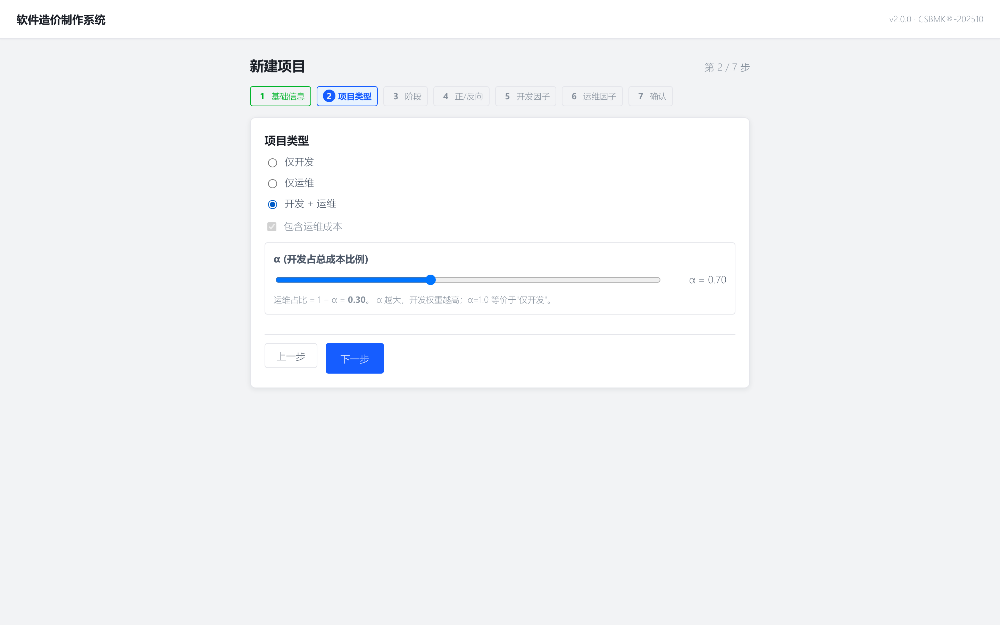

#### Step 3：阶段 + CF 实时预览

5 个阶段（预算 / 招标 / 立项 / 变更 / 结算）每张卡显示对应 CF 值，选定后底部 summary 高亮当前 CF。

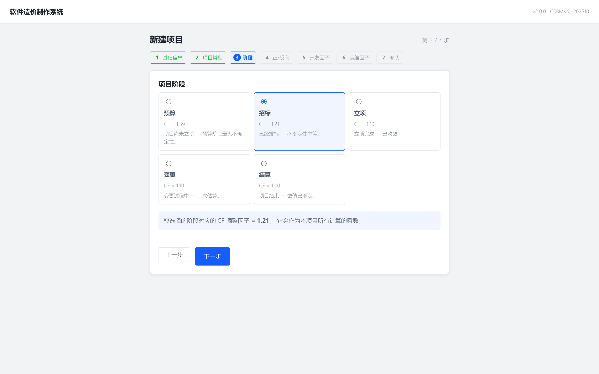

#### Step 4：正向 / 反向

reverse 模式时出现"目标总成本"输入框。

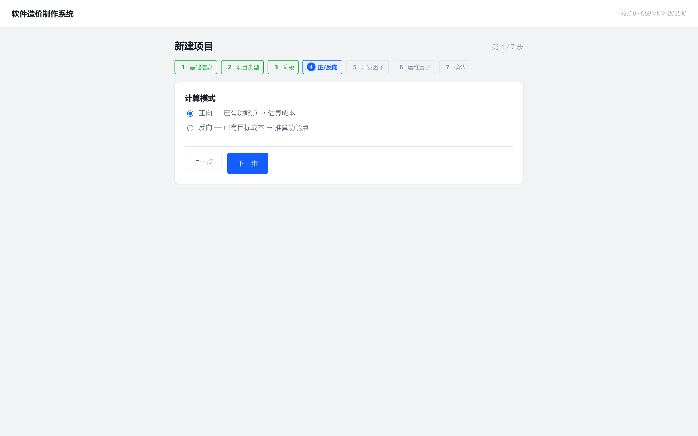

#### Step 5：开发因子链

每个 dropdown 选项显示 `级别 — ×multiplier`，底部框内 **dev_factor 链 = 多个 multiplier 相乘**实时更新。

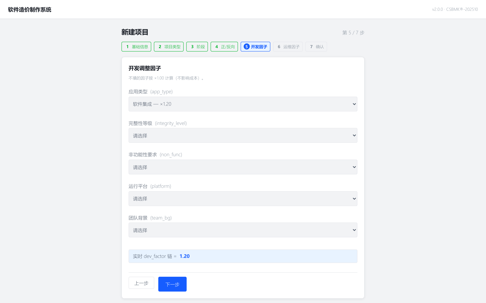

#### Step 7：确认

最后一步 review 全部选择 + 因子清单；客户/评估方为空时显示 `—`。

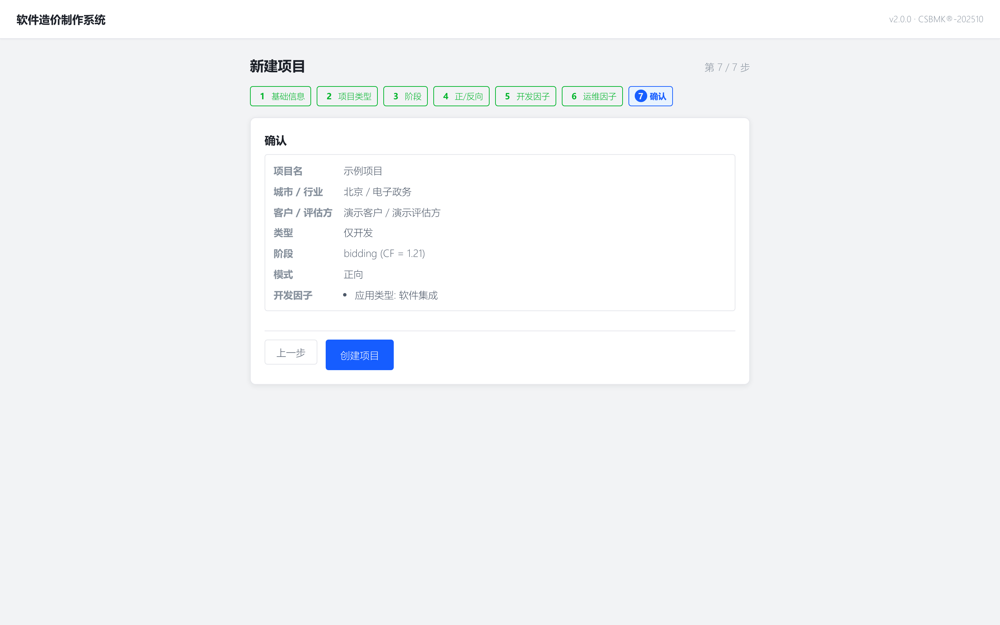

每步底部有"上一步 / 下一步"按钮；未通过 `canAdvance` 校验时"下一步"按钮 disabled。

### 12.4 ParamManager 6 Tab（GAP-B / GAP-D / GAP-H）

v1.1 的 ParamManager 只实装了费率与生产率两个 tab，其余 4 个为 v2 占位；v2.0 全部实装：

| Tab | v2.0 改动 |
|---|---|
| **费率** | 城市 × 两列：开发费率 + **运维费率**（元/人月）（GAP-D） |
| **生产率** | 行业 × 三档 PDR，新增 **运维行业** 子表（GAP-D） |
| **开发因子** | 5 个因子卡：每个 level 一行可编辑 multiplier（GAP-B） |
| **运维因子** | 11 个因子卡，同上结构 |
| **规模变更** | 新增 / 修改 / 删除 / 转换 / 变更率门槛 5 项（GAP-B） |
| **快照** | 创建 / 恢复 / 删除全局参数快照（GAP-H） |

#### 费率 tab

每个城市一行，开发 / 运维两个输入框；覆写默认值后右侧出现"自定义"徽标 + reset 按钮。


#### 开发因子 tab

5 个因子卡（应用类型 / 完整性等级 / 非功能性要求 / 运行平台 / 团队背景），每个因子内部一张表，级别 × multiplier 可编辑。CSBMK 默认 multiplier=1.00 — 自定义后行高亮。

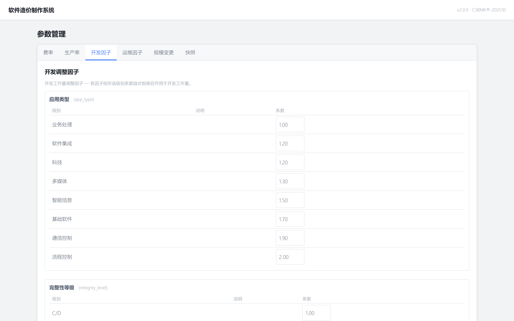

#### 规模变更 tab

5 项变更类型的 factor 值；CSBMK®-202510 默认值：新增 1.0 / 修改 0.7 / 删除 0.4 / 转换 0.6 / 变更率门槛 0.05。

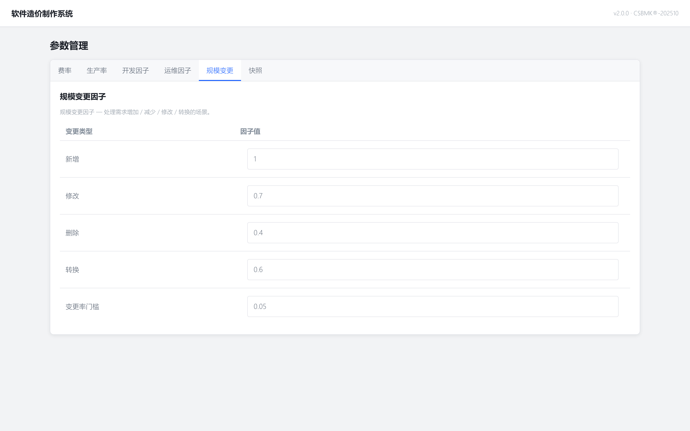

#### 快照 tab（GAP-H）

工具栏：备注输入框 + "立即快照"按钮。下方列出已有快照（ID / 备注 / 时间 / 操作）。

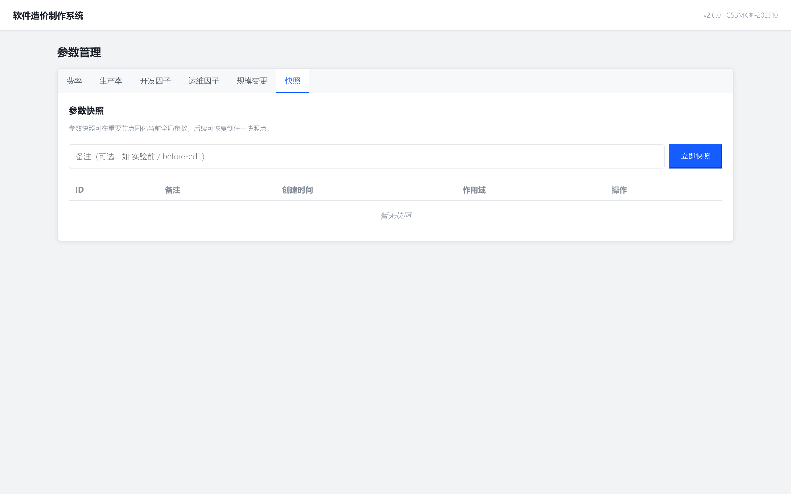

#### 快照工作流（GAP-H）

1. 调好一组参数后，在快照 tab 输入备注（如 "投标版-2026Q2"）→ 点 **"立即快照"**
2. 后续覆盖 / 重置 / 误改后，回到快照 tab 选历史条目点 **"恢复"** → 二次确认 → 全局 effective 参数整体回滚
3. 不再需要的快照可直接 **"删除"**（二次确认）

> 注意：快照存储 effective_params 完整序列化 JSON；restore 走 leaf-by-leaf patch_global，遇到 stale 字段（如 CSBMK 升级后删除的某 key）自动跳过。

### 12.5 ProjectList 搜索 + ⋯ 菜单（GAP-F / GAP-I）

ProjectList toolbar 上新增搜索 + 4 维筛选 + 排序 + 分页：


- **搜索框**：项目名子串实时匹配（250ms 防抖）
- **城市 / 行业 / 阶段**：3 个 dropdown 筛选（mode 通过项目类型自然过滤）
- **排序字段** / **升降序**：按 created_at / updated_at / name / target_cost；↑ 升 / ↓ 降
- **分页**：每页 20 条，total > 20 时显示"上一页 / 下一页"

每行 **⋯ 菜单**（点击 trigger 弹出）：

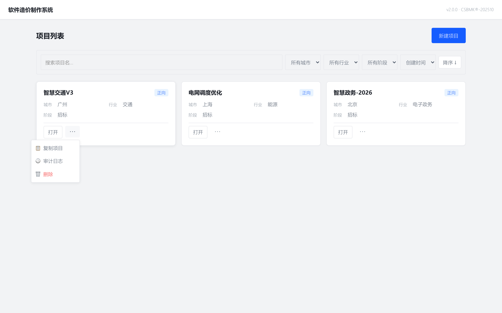

- **📋 复制项目** → 弹出 prompt 输入新名 → 调 `/api/projects/{id}/copy` → 跳到新项目的 FP 编辑屏（含 FP 行 + ParamOverride 行，不带 Result / FPSnapshot / Upload）
- **🕒 审计日志** → 跳 `/projects/:id/audit`
- **🗑️ 删除** → 二次 `confirm` 对话框（"确定删除「项目名」？该操作不可恢复。"）

> 项目卡片上还有"打开"按钮（独立于 ⋯ 菜单，直接跳 FP 编辑屏）。

### 12.6 审计日志查看（GAP-J）

每个项目维护独立审计时间线，所有 mutating 操作（创建 / 更新 / 删除 / FP 增改删 / FP 批量写入 / FP 快照恢复 / 参数覆盖 / 上传 / 计算运行 / 报告导出 / 复制）自动写入 `audit_log` 表。


- **入口**：项目行 ⋯ 菜单 → **"🕒 审计日志"**，或直接访问 `/projects/:id/audit`
- **字段**：时间戳 / 操作中文标签（如"📦 批量写入 FP"）/ actor（v2 单用户始终为 `"user"`，v3 多用户时切换为登录用户 ID）
- **`diff_json` 字段** 序列化 `{sub_path, query}` — 例如 `fp.restore?version=3` 会记录 `{"sub_path": "functions/restore", "query": {"version": "3"}}`，事后能精确还原是哪条具体操作；`project.copy` 副本入口额外含 `copied_from`
- **分页**：cursor 分页（`before_id`），每页 50 条；超过 50 显示"加载更早记录"
- **用途**：对账、回溯误操作、向第三方造价审计单位提供操作证据

### 12.7 数据迁移（v1.1 → v2.0）

升级到 v2.0 不会丢失任何 v1.1 数据，但需要跑 3 个新 migration：

```bash
cd server
alembic upgrade head
```

应用的 migration：
- 给 `projects` 表加 `factors_dev_json` / `factors_ops_json` 列
- 新建 `param_snapshots` 表
- 新建 `audit_log` 表

#### 兼容性

| 老数据 | v2.0 行为 |
|---|---|
| `factors_dev_json` / `factors_ops_json` 为 NULL | calc 用 1.0 兜底，`Result.warning_messages` 提示 "项目无因子配置，按 1.0 计算" |
| 已有 FP / 参数 override / 上传文件 | 全部保留，不受 schema 变更影响 |
| 老 Excel 报告 | 仍可重新生成；客户 / 评估方字段在封面留空（显示 `—`） |
| `/api/projects` 旧客户端 | 新版返回 envelope `{success, data, error, meta:{total, page, size}}`，前端 v2 `projectsApi.list()` 已透明兼容；外部 v1 客户端需解包 `data` 字段 |

> **备份**：升级前用 `sqlite3 <COST_DB_PATH> .dump > backup.sql` 备份（`COST_DB_PATH` 在 server 启动时通过环境变量指定，默认 `~/.claude/projects/cost-estimation/.data/cost.sqlite`）。migration 失败可 `alembic downgrade -1` 单步回滚。

### 12.8 新 API endpoint 速查

| Method | Path | 说明 |
|---|---|---|
| POST | `/api/projects/{id}/copy` | 项目复制（GAP-I） |
| GET | `/api/projects/{id}/audit` | 项目审计日志，cursor 分页（GAP-J） |
| GET | `/api/params/snapshots` | 快照列表（GAP-H） |
| POST | `/api/params/snapshots` | 创建快照 |
| POST | `/api/params/snapshots/{id}/restore` | 恢复快照 |
| DELETE | `/api/params/snapshots/{id}` | 删除快照 |
| GET | `/api/projects` | 升级查询参数 q / city / industry / phase / mode / sort / order / page / size（GAP-F） |
| GET | `/api/params/effective` | 全局 effective 视图（无项目作用域） |

详见 [dev-guide.md](dev-guide.md) §API 参考。

---

## 附录 A 公式速查

### A.1 NESMA UFP 权重表（估算法默认 = 中复杂度）

| 类别 | 全称 | 复杂度（低/中/高 UFP） | 估算法默认 |
|---|---|---|---|
| **EI** | External Input | 3 / **4** / 6 | 4 |
| **EO** | External Output | 4 / **5** / 7 | 5 |
| **EQ** | External Inquiry | 3 / **4** / 6 | 4 |
| **ILF** | Internal Logical File | 7 / **10** / 15 | 10 |
| **EIF** | External Interface File | 5 / **7** / 10 | 7 |

### A.2 复杂度判定（详尽计数模式）

#### EI / EO / EQ 复杂度（基于 DET + FTR）

| FTR \ DET | 1-4 | 5-15 | ≥16 |
|---|---|---|---|
| 0-1 | 低 | 低 | 中 |
| 2 | 低 | 中 | 高 |
| ≥3 | 中 | 高 | 高 |

#### ILF / EIF 复杂度（基于 DET + RET）

| RET \ DET | 1-19 | 20-50 | ≥51 |
|---|---|---|---|
| 1 | 低 | 低 | 中 |
| 2-5 | 低 | 中 | 高 |
| ≥6 | 中 | 高 | 高 |

> DET = Data Element Types（字段数）  
> FTR = File Types Referenced（引用的文件数）  
> RET = Record Element Types（子记录类型数）

### A.3 US 公式（NESMA 估算法）

```
US_i = UFP_i × (1 - reuse_ratio_i × 0.5 - modify_ratio_i × 0.25)
```

- `reuse_ratio` ∈ [0, 1]：重用率（默认 0）
- `modify_ratio` ∈ [0, 1]：修改率（默认 0）

### A.4 正向计算全公式

```
1. US（未调整规模）= Σ FP[i].us
2. CF（阶段调整因子）= phase → {budget:1.39, bidding:1.21, planning:1.10, change:1.10, settled:1.00}
3. S（调整后规模）= US × CF
4. 对 PDR ∈ {P10, P50, P90}:
     EFF_dev_PM = S × dev_factor_product / PDR_dev      （人月）
     EFF_ops_PM = S × ops_factor_product / PDR_ops      （仅含运维时）
     EFF_total_PM = EFF_dev_PM + EFF_ops_PM
     Cost_total = EFF_total_PM × F_city + Other_cost   （元）
5. 输出 {dev: {P10, P50, P90}, ops: {P10, P50, P90}, total: {P10, P50, P90}}
```

> 常量：`hours_per_pm = 174`（CSBMK®-202510 默认）

### A.5 反向反推全公式

```
1. 可用预算 = T - Other_cost
2. 若 include_ops（默认 false, α 默认 1.0）:
     Budget_dev = (T - O) × α
     Budget_ops = (T - O) × (1 - α)
   否则:
     Budget_dev = T - O
     Budget_ops = 0
3. 各自反算（按 PDR 三档）：
     PM_dev = Budget_dev / F_city
     EFF_dev_unadjusted = PM_dev × hours_per_pm / dev_factor_product   （人时）
   类比 ops
4. 反求规模：
     S_乐观   = EFF_dev_unadjusted / PDR_dev_P10   （+ ops）
     S_中位   = EFF_dev_unadjusted / PDR_dev_P50   （推荐）
     S_保守   = EFF_dev_unadjusted / PDR_dev_P90
5. US = S / CF
6. 校验：若已有 FP 草稿合计 ∈ [S_保守, S_乐观]，预算合理；否则提示
```

### A.6 开发因子组合公式

```
F_dev = app_type × non_func × integrity × dev_lang × dev_team
non_func = (分布式 + 性能 + 可靠性 + 多重站点) × 0.025 + 1
         每项 ∈ {-1, 0, 1}
```

### A.7 运维因子组合公式

```
F_ops = 业务重要性 × 网络安全 × 支持方式 × 更新频率 × 响应时效
      × 完整性 × 采用技术 × 团队 × 部署方式 × 用户规模 × 系统关联性
```

### A.8 分摊算法（反向 + AI 辅助）

```
1. 锁定项隔离：
   S_locked = Σ(locked FP[i].us)
   S_free = S_target - S_locked × CF
   若 S_free ≤ 0 → 拒绝并提示"锁定项已超目标"

2. 未锁定项归一：
   UFP_i = round(S_free × w_i / Σ(unlocked w_j), 2)

3. 类别分布约束（仅作用于未锁定项）：
   ILF≈14% / EI≈50% / EO≈7% / EQ≈29% / EIF≈0%（±5% 漂移）

4. 双向一致性校验：
   forward(分摊后 FP, 含锁定项) → S_actual
   |S_actual - S_target| / S_target ≤ 1%
```

---

## 附录 B 词汇表

| 术语 | 全称 | 中文 | 说明 |
|---|---|---|---|
| **FP** | Function Point | 功能点 | 用户可识别的功能单位，NESMA/IFPUG 度量基本单元 |
| **UFP** | Unadjusted Function Point | 未调整功能点 | 按类别 + 复杂度赋权后的原始 FP 数 |
| **US** | Unadjusted Size | 未调整规模 | UFP 应用重用率/修改率后的规模 |
| **CF** | Calibration Factor / Conversion Factor | 阶段调整因子 | 5 阶段 1.39/1.21/1.10/1.10/1.00 |
| **PDR** | Project Delivery Rate | 项目交付率 | 单位规模的工作量（FP/PM 或 PM/FP） |
| **AE** | Adjusted Effort | 调整后工作量 | UE × Π(调整因子) |
| **UE** | Unadjusted Effort | 未调整工作量 | PDR × S |
| **PM** | Person Month | 人月 | 工作量单位（174 hours/PM） |
| **EI** | External Input | 外部输入 | 用户提交数据更新内部数据（增/改/删） |
| **EO** | External Output | 外部输出 | 含派生计算的对外输出（报表、统计） |
| **EQ** | External Inquiry | 外部查询 | 检索数据但不含派生计算（搜索、列表） |
| **ILF** | Internal Logical File | 内部逻辑文件 | 应用维护的核心实体（用户、订单） |
| **EIF** | External Interface File | 外部接口文件 | 跨系统引用的只读数据 |
| **DET** | Data Element Types | 数据元素类型 | 字段数 |
| **FTR** | File Types Referenced | 文件类型引用数 | 引用的文件数 |
| **RET** | Record Element Types | 记录元素类型 | 子记录类型数 |
| **NESMA** | Netherlands Software Metrics Association | 荷兰软件度量协会 | 提供估算法变体 |
| **IFPUG** | International Function Point Users Group | 国际功能点用户组 | 详细计数法 |
| **COSMIC** | Common Software Measurement International Consortium | COSMIC 国际联合体 | 第二代功能点方法（v2 待支持） |
| **CSBMK** | China Software Benchmarking Data | 中国软件行业基准数据 | 本系统内置 202510 版 |
| **P10/P50/P90** | 10th / 50th / 90th Percentile | 百分位数 | 行业 PDR 分布的乐观/中位/保守档 |
| **α (alpha)** | — | 开发占比系数 | 反向模式开发预算占总可用预算的比例（默认 1.0） |
| **CF（阶段）** | Calibration Factor | 阶段调整因子 | 1.39/1.21/1.10/1.10/1.00 |
| **CSRF** | Cross-Site Request Forgery | 跨站请求伪造 | 系统通过 token + Origin + CORS 三层防护 |
| **WAL** | Write-Ahead Logging | 预写日志 | SQLite 并发模式 |

---

## 附录 C 联系与支持

### 项目仓库

- **GitHub**: https://github.com/vinnyren/cost-estimation
- **Issues**: https://github.com/vinnyren/cost-estimation/issues
- **Discussions**: https://github.com/vinnyren/cost-estimation/discussions

### 数据基准来源

- **CSBMK®-202510**：中国软件行业协会系统工程分会
- **国家标准（GB/T）**：全国信息技术标准化技术委员会（SAC/TC 28）
- **团体标准（T/CCUA）**：中国通信工业协会

### 报 bug 模板

```markdown
**Plugin 版本**：v1.0.0
**Claude Code 版本**：（运行 /version 查看）
**操作系统**：（macOS 14.5 / Ubuntu 22.04 / WSL2）
**Python 版本**：（python3 --version）

**问题描述**：
（一句话描述）

**复现步骤**：
1. ...
2. ...

**期望结果**：
**实际结果**：
**日志**：
（粘贴 /tmp/cost-estimation.log 最后 50 行）
```

### License

**MIT License** — 详见仓库根目录 LICENSE 文件。

允许：
- ✓ 商业使用
- ✓ 修改
- ✓ 分发
- ✓ 私人使用

要求：
- 保留版权声明与 license 文本

### 致谢

- **Claude Code Plugin 平台** — Anthropic
- **NESMA / IFPUG 方法学** — 国际功能点社区
- **CSBMK 数据集** — 中国软件行业协会系统工程分会
- **GB/T 36964 / T/CCUA 005-2024** — 标准编制专家组

---

> **文档版本**：v2.0.0 · 最后更新 2026-05-11  
> **本版本变更**：v2.0 闭环 11 项 v1.1 后审计 gap（GAP-A 到 GAP-K），详见第 12 章  
> **下一版本计划**：v2.1（补充 COSMIC 方法、Excel 批量导入示例、移动端适配）
